# Linux进程检测与控制

# 学习目标

1、了解进程和程序的关系

2、了解进程的特点

3、能够使用top动态查看进程信息

4、能够使用ps静态查看进程信息

5、能够使用kill命令给进程发送信号

6、能够调整进程的优先级（扩展）

# 引言

​        在运维的日常工作中，监视系统的运行状况是每天例行的工作，在 Windows 中我们可以很直观的使用"任务管理器"来进行进程管理，了解系统的运行状态


通常，使用"任务管理器"主要有 3 个目的：

1. 利用"应用程序"和"进程"标签来査看系统中到底运行了哪些程序和进程；
2. 利用"性能"和"用户"标签来判断服务器的健康状态；
3. 在"应用程序"和"进程"标签中强制中止任务和进程；


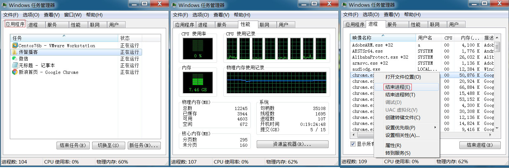

​        

​         在工作中，我们很少会用到Linux的图形化界面，更多时候会使用命令进行进程管理，但是进程管理的主要目的是一样的，即：

​    **查看系统中运行的程序和进程**

​    **判断服务器的健康状态**

​    **停止不需要的进程。**


# 一、相关概念

## 1、什么是进程和程序？

​        **进程**是正在执行的一个程序或命令，每个进程都是一个运行的实体，并占用一定的系统资源。**程序**是人使用计算机语言编写的可以实现特定目标或解决特定问题的代码集合。

​        简单来说，程序是人使用计算机语言编写的，可以实现一定功能，并且可以执行的代码集合。进程是正在执行中的程序。

**举例**：谷歌浏览器是一个程序，当我们打开谷歌浏览器，就会在系统中看到一个浏览器的进程，当程序被执行时，程序的代码都会被加载入内存，操作系统给这个进程分配一个 ID，称为 **PID**（进程 ID）。我们打开多个谷歌浏览器，就有多个浏览器子进程，但是这些进程使用的程序，都是chrome

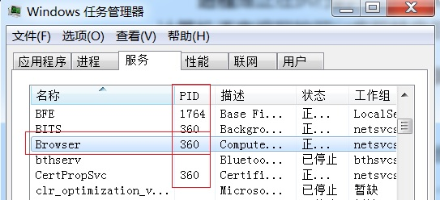


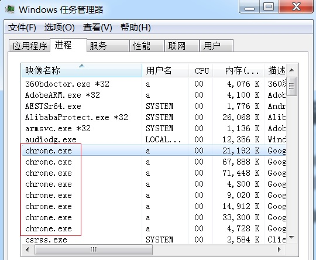

​    

## 2、进程管理的内容

​        进程查看，通过查看，判断健康状态

​        进程终止

​        进程优先级控制


# 二、进程管理命令

工作场景：

​        小黑入职到一家公司，接到的第一项任务，就是监控生产服务器的性能，提到服务器性能，我们首先想到的就是CPU，内存和磁盘。


## 1、top查看 CPU使用情况

命令：top

作用：查看服务器的进程占用的资源（100%使用）

语法：# top （动态显示）

交换操作快捷键：

M（大写）：表示将结果按照内存（MEM）从高到低进行降序排列；

P（大写）：，表示将结果按照CPU 使用率从高到低进行降序排列；

1 ：当服务器拥有多个cpu 的时候可以使用“1”快捷键来切换是否展示显示各个cpu 的详细信息；

q：退出


```powershell
用法一：top
示例代码：
#top
含义：查看CPU使用情况
```

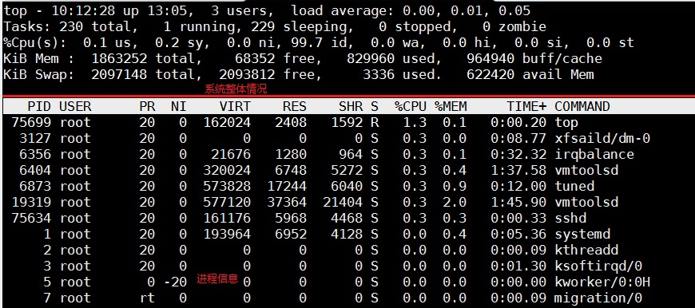

### 1）系统整体信息：

#### ①第一行

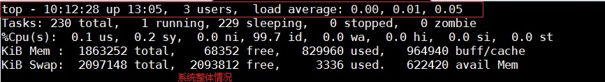

| 内 容                         | 说 明                                                        |
| ----------------------------- | ------------------------------------------------------------ |
| 10:12:28                      | 系统当前时间                                                 |
| up 13:05                      | 系统的运行时间.本机己经运行 13 小时 05 分钟                  |
| 3 users                       | 当前登录了三个用户                                           |
| load average: 0.00,0.01，0.05 | 系统在之前 1 分钟、5 分钟、15 分钟的平均负载。如果 CPU 是单核的，则这个数值超过 1 就是高负载：如果 CPU 是四核的，则这个数值超过 4 就是高负载 |

> 扩展：如何获取CPU的总核心数？
>
> grep 'core id' /proc/cpuinfo |sort -u |wc -l

#### ②第二行

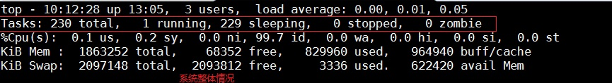

| Tasks:   230 total | 系统中的进程总数                                 |
| ------------------ | ------------------------------------------------ |
| 1 running          | 正在运行的进程数                                 |
| 229 sleeping       | 睡眠的进程数                                     |
| 0 stopped          | 正在停止的进程数                                 |
| 0 zombie           | 僵尸进程数。如果不是   0，则需要手工检查僵尸进程 |


#### ③第三行

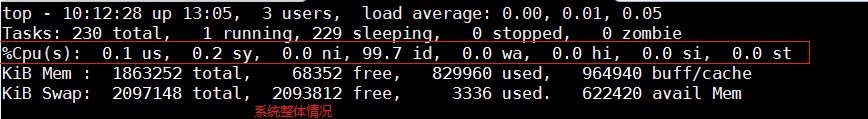

| 内 容           | 说 明                                                        |
| --------------- | ------------------------------------------------------------ |
| Cpu(s): 0.1 %us | 用户模式占用的   CPU 百分比                                  |
| 0.1%sy          | 系统模式占用的   CPU 百分比                                  |
| 0.0%ni          | 改变过优先级的用户进程占用的   CPU 百分比                    |
| 99.7%id         | idle缩写，空闲   CPU 占用的 CPU 百分比                       |
| 0.1%wa          | 等待输入/输出的进程占用的   CPU 百分比                       |
| 0.0%hi          | 硬中断请求服务占用的   CPU 百分比                            |
| 0.1%si          | 软中断请求服务占用的   CPU 百分比                            |
| 0.0%st          | st（steal   time）意为虚拟时间百分比，就是当有虚拟机时，虚拟 CPU 等待实际 CPU 的时间百分比 |

#### 问题：如果我的机器有4核CPU，我想查看每一核心分别的负载情况怎能办？

答：交换快捷键 “1”

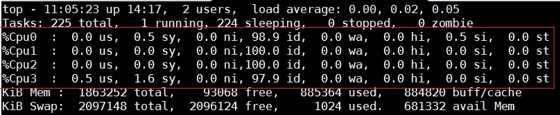


#### ④第四行

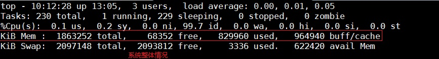

| 内 容              | 说 明                                                        |
| ------------------ | ------------------------------------------------------------ |
| Mem: 1863252 total | 物理内存的总量，单位为KB                                     |
| 829960 used        | 己经使用的物理内存数量                                       |
| 68352 free         | 空闲的物理内存数量。我们使用的是虚拟机，共分配了 628MB内存，所以只有53MB的空闲内存 |
| 96490 buff/cache   | 作为缓冲的内存数量                                           |

#### ⑤第五行

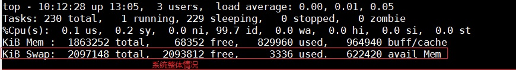

| 内 容               | 说 明                        |
| ------------------- | ---------------------------- |
| Swap: 2097148 total | 交换分区（虚拟内存）的总大小 |
| 3336 used           | 已经使用的交换分区的大小     |
| 2093812 free        | 空闲交换分区的大小           |
| 622420 avail Mem    | 可用内存                     |

​        我们通过 top 命令的整体信息部分，就可以判断服务器的健康状态。如果 1 分钟、5 分钟、15 分钟的平均负载高于CPU核数，说明系统压力较大。如果物理内存的空闲内存过小，则也证明系统压力较大。

问题：根据以上信息，目前我们的系统压力如何？

问题：如果我们发现CPU负载过大，接下来怎么办？


### 2）进程信息：

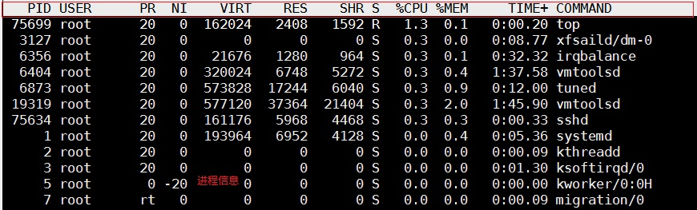

| PID     | 进程的 ID。                                                  |
| ------- | ------------------------------------------------------------ |
| USER    | 该进程所属的用户。                                           |
| PR      | 优先级，数值越小优先级越高。                                 |
| NI      | 优先级，数值越小优先级越高。                                 |
| VIRT    | 该进程使用的虚拟内存的大小，单位为 KB。                      |
| RES     | 该进程使用的物理内存的大小，单位为 KB。                      |
| SHR     | 共享内存大小，单位为 KB。计算一个进程实际使用的内存 = 常驻内存（RES）- 共享内存（SHR） |
| S       | 进程状态。其中S 表示睡眠，R 表示运行                         |
| %CPU    | 该进程占用 CPU 的百分比。                                    |
| %MEM    | 该进程占用内存的百分比。                                     |
| TIME+   | 该进程共占用的 CPU 时间。                                    |
| COMMAND | 进程名                                                       |

#### 问题：如果我们发现CPU负载过大，接下来怎么办？

答：查看占用CPU最多的进程


#### 问题：如何查看占用CPU最多的进程？

答：交互操作快捷键P，P（大写）：，表示将结果按照CPU 使用率从高到低进行降序排列

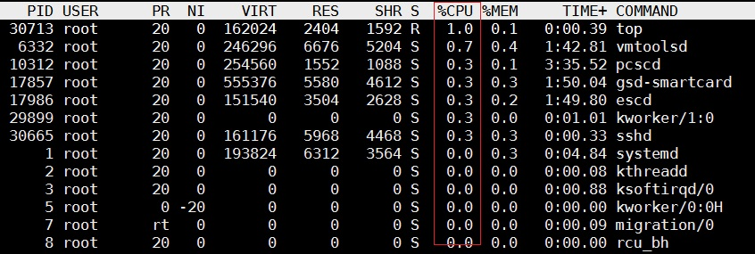


#### 问题：如果我们发现内存可用量很小，接下来怎么办？

答：查看占用内存最多的进程，使用交互快捷键M（大写）：表示将结果按照内存（MEM）从高到低进行降序排列

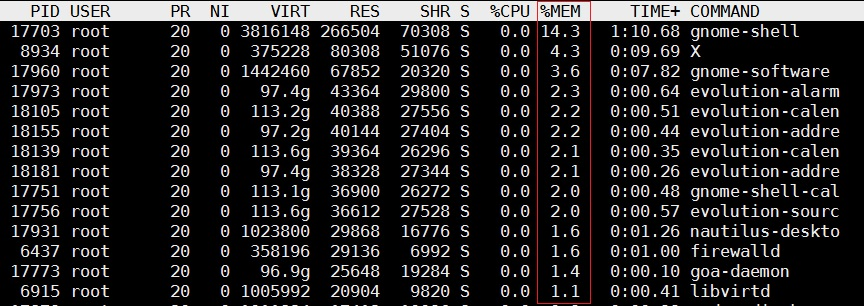


#### 问题：当我们查看完系统状态，需要做什么？

答：退出，使用q，按键盘上的q，就会回到#提示符的状态。


## 2、free查看内存使用情况

命令：free

作用：查看内存使用情况

语法：#free  -m 

选项：-m 表示以mb为单位查看（1g = 1024mb，1mb = 1024kb）

```powershell
用法一：free -m
示例代码：
#free -m
含义：查看内存使用情况
```

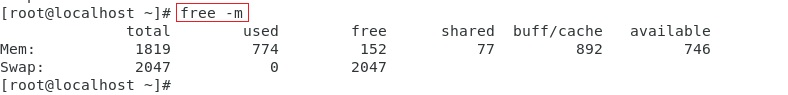


​    和Centos6相比，buffer和cached被合成一组，加入了一个available。

​    关于此available，即系统可用内存，用户不需要去计算buffer/cache，即可以看到还有多少内存可用，更加简单直观

```powershell
第1行Mem数据：
total 内存总数: 1819
used 已经使用的内存数: 774
free 空闲的内存数: 152
shared 共享内存数: 77
buff/Cache块设备缓存区内存数: 892
available可用内存: 746

第2行数据是Swap交换分区，也就是我们通常所说的虚拟内存。可以在内存不够使用的情况下当临时内存来使用，交换分区并不是越大越好，一般话它就等同于实际内存的大小。
```

# 

## 3、df查看磁盘

命令：df

作用：查看磁盘的空间(disk  free)

语法：# df   [-h]

选项：-h表示可读性较高的形式展示大小

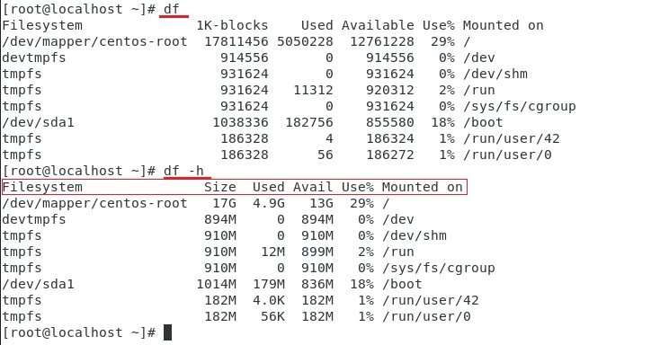

这几列依次是：

| Filesystem | 磁盘名称                           |
| ---------- | ---------------------------------- |
| Size       | 总大小                             |
| Used       | 被使用的大小                       |
| Avail      | 剩余大小                           |
| Use%       | 使用百分比                         |
| Mounted on | 挂载路径（相当于Windows 的磁盘符） |


回到开始的工作场景：

​        小黑入职到一家公司，接到的第一项任务，就是监控生产服务器的性能，提到服务器性能，我们首先想到的就是CPU，内存和磁盘。

#### 问题：小黑具体应该如何监控CPU，内存和磁盘？

总结：CPU：

​           内存：

​           磁盘：

#### 作业1：课下将总结的部分落实到笔记


## 4、ps查看进程命令

命令：ps（process show进程显示）

语法：ps [参数选项]

作用：主要是查看服务器的进程信息

选项含义：

-e：等价于“-A”，表示列出全部（all）的进程

-f :   表示full，显示全部的列（显示全字段）

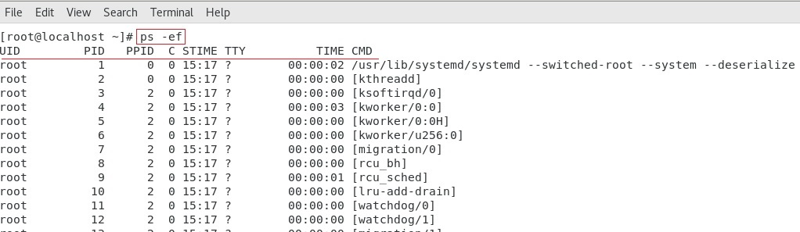

| UID   | 该进程执行的用户ID                                           |
| ----- | ------------------------------------------------------------ |
| PID   | 进程ID                                                       |
| PPID  | 该进程的父级进程ID，如果找不到，则该进程就被称之为僵尸进程（Parent Process ID） |
| C     | Cpu的占用率，其形式是百分数                                  |
| STIME | 进程的启动时间                                               |
| TTY   | 终端设备，发起该进程的设备识别符号，如果显示“?”则表示该进程并不是由终端设备发起 |
| TIME  | 进程实际使用CPU的时间                                        |
| CMD   | 该进程的名称或者对应的路径                                   |

工作场景

​        小黑用学到的命令，发现某个进程占用CPU很高，希望进一步查看这个简称的信息。

​        ps -ef 会列出全部进程，但是我们发现进程非常多，我们很难找到自己想要看的进程。这里需要使用过滤命令grep，来过滤掉我们不需要的信息。

```powershell
用法：ps -ef |grep 想要看到的进程名
示例代码：
#ps -ef |grep crond
含义：查看crond进程的详细情况
注意：查询结果中，如果只有一条则表示没查到对应的进程（这1 条表示刚才ps 指令的自身）。只有查到的结果多余1 条，才表示有对应的进程。
```

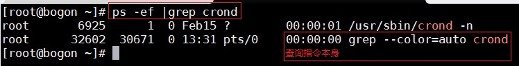

> 补充：针对上述情况的优化：如果没有对应的进程，则什么都不显示。

思路：在现有的基础之上再次使用管道去处理下（-v 选项表示“排除”）。


扩展：ps  aux  BSD格式命令，注意没有横杠"-"

Unix有很多分支，目前主流的显示风格分为System V和BSD，我们之前使用的ps -ef属于system V风格，ps aux是BSD风格，大家可以理解为两种风格只是显示不同。

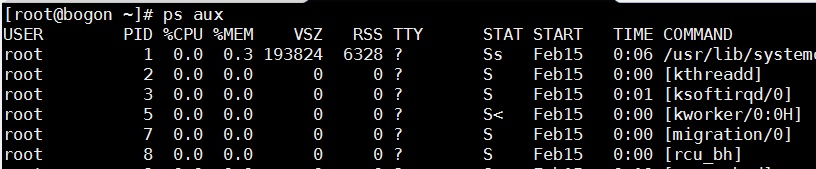


USER：该 process 属于哪个使用者账号
PID ：该 process 的ID
%CPU：该 process 使用掉的 CPU 资源百分比
%MEM：该 process 所占用的物理内存百分比
VSZ ：该 process 使用掉的虚拟内存量 (Kbytes)
RSS ：该 process 占用的固定的内存量 (Kbytes)
TTY ：该 process 是在那个终端机上面运作，若与终端机无关，则显示 ?，另外， tty1-tty6 是本机上面的登入者程序，若为 pts/0 等等的，则表示为由网络连接进主机的程序。
STAT：该程序目前的状态，主要的状态有
​    R ：该程序目前正在运作，或者是可被运作
​    S ：该程序目前正在睡眠当中 (可说是 idle 状态)，但可被某些讯号 (signal) 唤醒。
​    T ：该程序目前正在侦测或者是停止了
​    Z ：该程序应该已经终止，但是其父程序却无法正常的终止他，造成 zombie (疆尸) 程序的状态
START：该 process 被触发启动的时间
TIME ：该 process 实际使用 CPU 运作的时间
COMMAND：该程序的实际指令


## 5、netstat查看进程网络访问

命令：netstat

作用：查看网络连接状态

语法：netstat   -tnlp

选项：-t：表示只列出tcp 协议的连接；

​	   -n：表示将地址从字母组合转化成ip 地址，将协议转化成端口号来显示；

​	   -l ：表示过滤出"state（状态）"列中其值为LISTEN（监听）的连接；

​	   -p：表示显示发起连接的进程pid 和进程名称；


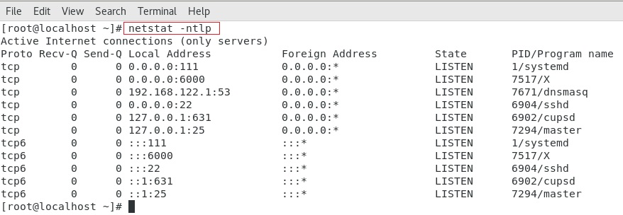

```powershell
Protocol：协议（tcp、upd、http、https、icmp、ssh…）
Receive：接收
Send：发送
Local Address:本地地址
Foreign：远程地址
State：状态，LISTEN表示侦听来自远方的TCP端口的连接请求
PID/Program name：进程ID和程序名
```


## 6、kill关闭进程

命令：kill

语法：kill [信号] PID

作用：kill 命令会向操作系统内核发送一个信号（多是终止信号）和目标进程的 PID，然后系统内核根据收到的信号类型，对指定进程进行相应的操作

信号种类：

| 信号编号 | 含义                                     |
| -------- | ---------------------------------------- |
| 9        | 杀死进程，即强制结束进程。               |
| 15       | 正常结束进程，是 kill   命令的默认信号。 |

```powershell
用法一：kill [信号编号] PID
示例代码：
#ps -ef |grep crond
查询crond进程信息，想知道它的PID，以便使用kill终止进程

#kill 6925
结束6925的进程，这里使用默认信号，正常结束，如果强制结束，就是kill -9 6925

#ps -ef |grep crond
查询crond进程信息,这次查询是为了确认crond进程是否被终止了，我们发现6925进程已经没有了

#systemctl start crond
使用前面学过的systemctl命令，重启crond服务

#ps -ef |grep crond
查询crond进程信息,这次查询是为了确认crond进程已经重新启动了，我们看到多了一个32934的进程，表明crond已经启动，并且进程ID变化了，这是一个新的进程
```

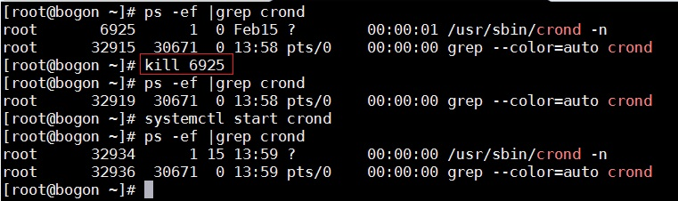

> 备注：在互联网中，经常看到kill  -9  进程PID，强制杀死某个进程，kill -l


## 7、killall关闭进程

命令：killall

作用：通过程序的==进程名==来杀死==一类==进程

语法：# killall  [信号] 进程名称

信号种类：和kill相同，这里不再重复

```powershell
用法一：killall [信号编号] 进程名
示例代码：
#ps -ef |grep crond
查询crond进程信息，想知道它的进程名，以便使用killall终止进程

#kill 6925
结束6925的进程，这里使用默认信号，正常结束，如果强制结束，就是kill -9 6925
```


# 三、进程优先级

## 1、什么是进程优先级？

​        Linux是一个多用户、多任务的操作系统，系统中通常运行着非常多的进程。哪些进程先运行，哪些进程后运行，就由进程优先级来控制


## 2、查看进程优先级


PR  优先级，数值越小优先级越高。  
NI  优先级，数值越小优先级越高。

问题：这两个数值是在哪里看到的？

答：


## 3、调整进程优先级

#### ① 调整==正在运行==进程的优先级(renice)

##### 1）使用top按"r"来调整

​      如果要改变某个进程的优先级，就要利用 "r" 交互命令。

```powershell
改变NICE--->PR
优先级的范围：
-20——19  数字越低，优先级越高，系统会按照更多的cpu时间给该进程
注意：我们能够修改的只有 Ni 的优先级，而不能修改 Pr 的优先级。
```

步骤1：运行top命令，按r，会提示输入希望修改优先级的进程的PID，这里输入6451，表示想修改firewalld进程的优先级

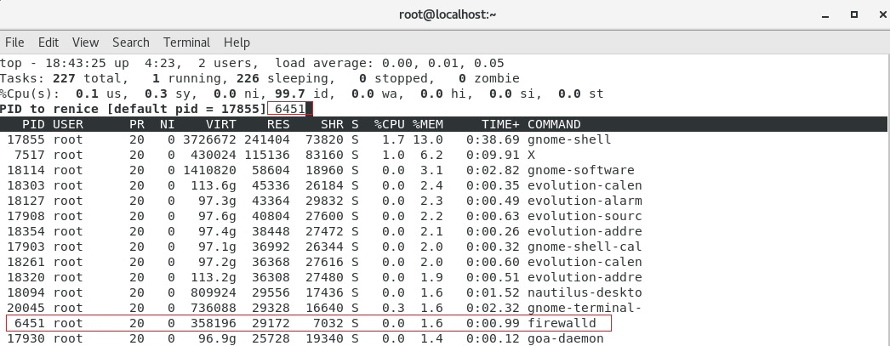

步骤2：输入6451后回车，提示希望修改的具体数字，这个数字是从-20到19，这里输入5，数字越大，优先级别越低，所以，这里是降低了firewalld的优先级

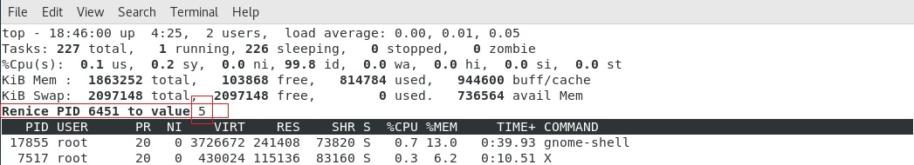


步骤3：输入5后，按回车，会发现6451进程的NI, 从0变成了5，PR从20变成了25

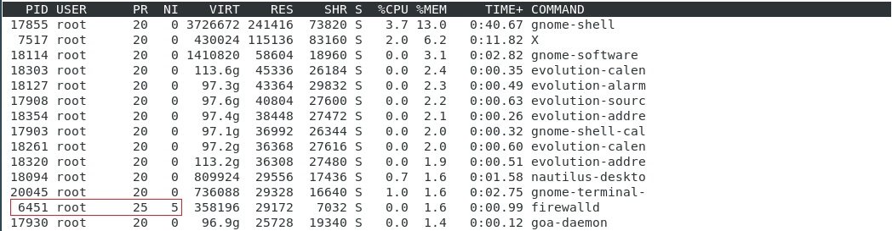


##### 2）命令行使用renice调整

```powershell
命令：renice
语法：renice [NI优先级设置的数字] 想调整的进程ID
[root@localhost ~]# renice -5 6451
含义：将6451进程的NI优先级设置为-5，实际效果是提高了6451进程的优先级
注意：这里的-5代表设置成-5，不是所谓加减的关系，如果当前NI的值是10，当设置成-5后，NI的值会变为-5.
```

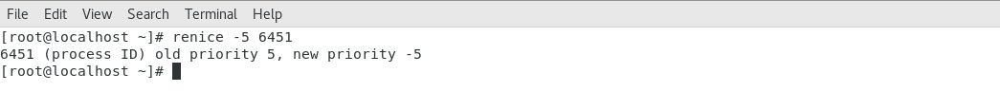

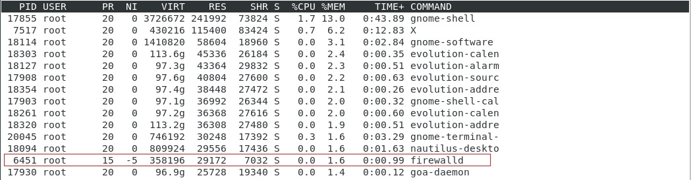


#### ② 程序启动时指定优先级(nice)，只能调整不在运行的程序。

步骤1：将程序停止


步骤2：启动并制定优先级


步骤3：确认优先级（查看优先级）


```powershell
命令：nice
语法：nice [NI优先级设置的数字] 想调整的进程名
启动进程时，通常会继承父进程的 nice级别，默认为0
#ps -ef |grep crond
含义：查看crond的进程信息
目的：找出crond的PID，用于结束进程

#kill -9 crond的进程ID
含义：结束crond的进程
目的：nice只能修改不在运行的进程的优先级

#ps -ef |grep crond
含义:查看crond的进程信息
目的：确认crond进程是不是已经停止了

#nice -n -5 crond
含义：启动crond进程，将NI设置成-5


#ps -ef |grep crond
含义：查看crond的进程信息
目的：找出crond的PID，用于查看此进程的优先级

#top -p crond的进程ID
含义：使用TOP命令，只查看和crond进程相关的信息

```

### 


