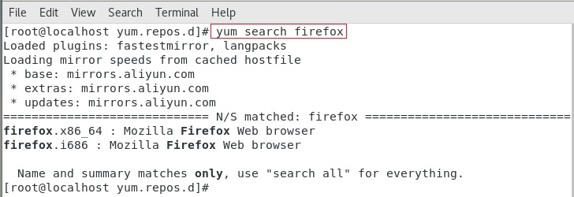
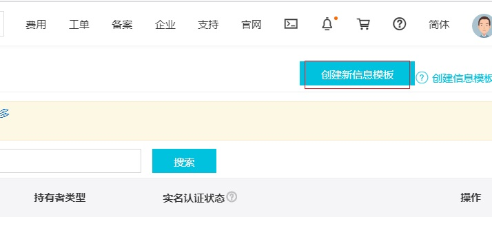

# YUM与开源项目实战（Web运维）

# 学习目标

1、了解Linux软件的安装方式

2、掌握更新yum源

3、掌握YUM软件安装方式

4、了解LAMP环境以及AMP的关系

5、了解阿里云ECS的创建过程

6、能够yum方式搭建lamp环境

7、能够实现Discuz!论坛部署

8、能够购买域名与解析域名

# 引言

## 1、项目背景

​        学员小白，目前刚入职了一家电子商务公司。主要负责大型商城系统维护，公司主营母婴用品，如奶瓶、奶嘴、童装等等，最近，很多客服发现一个问题：很多宝妈会在评论区互相咨询产品相关信息。

​        于是公司决定针对这一需求，要求运维为公司迅速上线一款论坛系统，方便宝妈交流产品、育儿心得等等。

## 2、项目需求

满足功能，并且省钱（开源项目）

Discuz！ =  Apache +  PHP + MySQL

# 一、YUM概述

## 1、Linux软件的安装方式

在CentOS系统中，软件管理方式通常有三种方式：`rpm安装`、`yum安装`以及`编译安装`。

```powershell
编译安装，从过程上来讲比较麻烦，包需要用户自行下载，下载的是源码包，需要进行编译操作，编译好了才能进行安装，这个过程对于刚接触Linux的人来说比较麻烦，而且还容易出错。好处在于是源码包，对于有需要自定义模块的用户来说非常方便。(就业班会着重讲解)
```

## 2、什么是yum

​        Yum（全称为 `Yellow dog Updater, Modified`）是一个在Fedora和RedHat以及CentOS中的Shell前端软件包管理器。

​        基于rpm包管理，能够从**指定的服务器**(yum源）自动下载RPM包并且安装，可以==自动处理依赖性关系==，并且==一次安装所有依赖的软件包==，无须繁琐地一次次下载、安装。

yum配置文件位置

```powershell
#cd /etc/yum.repos.d/
#ll
```


-rw-r--r--. 1 root root 1991 Mar 28  2017 CentOS-Base.repo            网络yum源配置文件
-rw-r--r--. 1 root root  647 Mar 28  2017 CentOS-Debuginfo.repo   内核相关的更新包
-rw-r--r--. 1 root root  289 Mar 28  2017 CentOS-fasttrack.repo     快速通道
-rw-r--r--. 1 root root  630 Mar 28  2017 CentOS-Media.repo           本地yum源配置文件
-rw-r--r--. 1 root root 7989 Mar 28  2017 CentOS-Vault.repo          最近版本加入老本的YUM配置   


## 3、配置阿里yum源

​        使用阿里yum源代替系统默认的yum源

```powershell
① 备份默认源
#cd /etc/yum.repos.d/
#mv CentOS-Base.repo CentOS-Base.repo.bak

② 下载新CentOS-Base.repo
#wget -O /etc/yum.repos.d/CentOS-Base.repo http://mirrors.aliyun.com/repo/Centos-7.repo
含义:使用阿里云的yum源代替默认的yum源，下载软件更快


③ 清除所有缓存
#yum clean all 

④ 重新生成缓存
#yum makecache
```

<http://mirrors.aliyun.com/repo/>选择不同centos版本的yum源


## 4、yum命令

### ① 查询操作

语法：\# yum  search  关键词



### ② 安装操作

语法：# yum  [-y]   install  关键词


### ③ 卸载操作

语法：# yum  [-y]  remove  关键词


### ④ 更新操作

语法：#yum [-y]  update  [包的关键词]

特别注意：包的关键词如果不写，则表示更新整个系统（全局更新，也包含内核）


# 二、LAMP概述

## 1、什么是LAMP

LAMP：==L==inux + ==A==pache + ==M==ySQL + ==P==HP                        LAMP 架构（组合）

LNMP：Linux + Nginx + MySQL + php-fpm                             LNMP 架构（组合）

LNMPA：Linux + Nginx(80) + MySQL + PHP + Apache           Nginx 代理方式


Apache：Apache是世界使用排名第一的Web服务器软件。

PHP：一种专门用于Web开发的编程语言。

MySQL：MySQL是一个关系型数据库管理系统，主要用于永久存储项目数据。


# 三、LAMP环境准备（阿里云）

要想部署一个互联网上可以访问到的环境，必须先具备以下内容 ：

服务器（IP、帐号密码、终端）、相应的软件、域名（备案、解析）、代码等。

## 1、注册阿里云账号

阿里云官网：https://www.aliyun.com/


## 2、实名认证

步骤1：鼠标移动到屏幕右上角的头像，在弹出菜单中选择实名认证


步骤2：在认证页面，需选择个人实名认证


步骤3：选择支付宝授权认证


步骤4：勾选同意，点击提交


步骤5：支付宝扫描二维码，手机上选择确认登录


步骤6：填写相关信息，点击确认


## 3、进入管理控制台


## 4、购买阿里云服务器


## 5、MobaXterm连接服务器


# 四、部署LAMP环境

## 1、部署前的环境准备

### 1）关闭防火墙和selinux

```powershell
#systemctl stop firewalld

#setenforce 0
临时关闭

#getenforce
查看当前是否关闭了selinux

#vim /etc/selinux/config
编辑selinux配置文件，永久关闭
```


### 2）查询当前服务器是否安装apache

使用rpm命令


### 3）查询当前服务器是否安装MYSQL

使用rpm命令


### 4）查询当前服务器是否安装PHP

使用rpm命令


```powershell
建议使用一台新装的Linux，因为卸载如果有残留，也容易给后续搭建带来未知的问题。
```


## 2、LAMP环境之Apache安装

① 使用yum命令安装httpd软件包


② 配置/etc/httpd/conf/httpd.conf文件


搜索ServerName，在下面添加一行：

ServerName Localhost:80

```powershell
#vim /etc/httpd/conf/httpd.conf

ServerName localhost:80
```


问题：保存退出用什么命令？

答：


③ 使用systemctl命令重启httpd服务,使用netstat -ntlp命令，查看是否有80端口监听


④ 设置httpd服务开机启动


⑤ 查看本机的IP地址,阿里云服务器从控制台可以看到


⑥在浏览器中，输入本机IP地址，如下图所示：


```powershell
注意：自己的服务器在设置时，一定要管理防火墙与SELinux，避免产生异常
① 关闭防火墙    命令：# service iptables stop
② 关系SELinux  命令：# setenforce 0
```


## 3、LAMP环境之MySQL安装

### 1）下载mysql的yum源

由于yum源上默认没有mysql-server。所以必须去官网下载后在安装

```powershell
#wget http://dev.mysql.com/get/mysql-community-release-el7-5.noarch.rpm
含义：下载myslq的yum源

```


### 2)添加mysql的yum源存储库


```powershell

#rpm -ivh mysql-community-release-el7-5.noarch.rpm
含义：安装mysql的yum源存储库包
```


### 3）安装MYSQL


```powershell
#yum -y install mysql-community-server
```


### 4)启动mysql

```powershell
#systemctl restart mysqld.service

#netstat -ntlp
```


### 5）初始化数据库

#### ①初始化数据

​    默认情况下，数据库没有密码，也没有任何数据，必须要初始化

```powershell
#mysql_secure_installation
含义：mysql自己带的初始化程序
```


设置超级管理员root密码，注：默认为空，直接回车即可


移除匿名账户：


不禁用root远程连接：


不移除默认数据库（测试用例）：


重新加载权限：Y

提示已完成，感谢使用MySQL


#### ②把mysqld添加到开机启动

​        默认已经开机启动，这里可以跳过


#### ③连接,MySQL数据库

```powershell
#mysql -uroot -p
含义：-u是参数，后面跟用户名，没有空格
-p表示密码
看到mysql>表示已经连接到mysql
```


#### ④查看数据库

```powershell
myslq> show databases;
含义：显示所有数据库
注意：命令结尾要有“;”
```


mysql>下输入exit，退出mysql，回到#提示符


 

## 4、LAMP环境之PHP安装

① 使用yum命令安装php、

```powershell
#yum -y install php

#systemctl restart httpd
```


② 重启httpd服务

​    更改php配置一定要重启httpd服务


③ 测试LAMP环境是否可以使用

第一步：使用cd命令进入/var/www/html目录

第二步：使用vim命令创建index.php文件

第三步：编写php代码

```powershell
代码示例：
#cd /var/www/html/
#vim index.php

<?php
    echo 'hello world';
?>

```


第四步：在浏览器，输入公网IP，如下图所示：


# 四、部署Discuz!论坛

## 1、Discuz!论坛概述

Discuz!是一套开源的社区论坛软件系统。


## 2、下载源代码

下载地址：https://gitee.com/ComsenzDiscuz/DiscuzX


## 3、使用MobaXterm上传代码

1）把ComsenzDiscuz-DiscuzX-master.zip文件通过MobaXterm上传到ECS服务器的/usr/local目录


2）安装unzip命令并且解压缩论坛代码

```powershell
#yum -y install unzip
#unzip ComsenzDiscuz-DiscuzX-master.zip
含义：解压缩ComsenzDiscuz-DiscuzX-master.zip文件
#ll

```


解压缩后，得到DiscuzX目录，其中upload文件夹下是真正的网站代码文件


3）将网站代码拷贝到/var/www/html下

```powershell
示例代码：
#cp -r /usr/local/DiscuzX/upload/* /var/www/html/

#cd /var/www/html/
#ll

```


# 五、安装Discuz!论坛

## 1、安装Discuz!前期准备

​        首先查看Discuz!源代码文件是否已经上传完成，必须完成后，才可以进行Discuz!论坛安装。

## 2、使用服务器IP地址访问论坛

看到下面的页面表示访问成功，点击我同意


## 3、设置目录权限


如上图所示，系统提示很多文件没有可写权限，设置如下：

```powershell
#chmod -R a+w /var/www/html/

```


重新刷新，如下图所示：


## 4、安装PHP扩展


如上图所示：以上结果代表系统缺少php-mysqli扩展，安装后即可解决。


① 使用yum命令安装php-mysqli扩展

```powershell
#yum -y install php-mysqli
```


② 重启httpd服务


重新刷新网页，如下图所示：


## 5、设置运行环境

​        开始安装页面已经没有任何报错，点击下一步，进入设置运行环境页面


## 6、设置数据库信息与管理员信息


## 7、访问安装后的论坛


进入论坛首页，如下图所示：


到此，关于LAMP环境配置与开源Discuz!项目实战就全部搞定了！


# 六、通过域名访问网站（扩展）

## 1、为什么需要域名

​        我们现在访问论坛是通过IP地址实现的，但是IP地址比较复杂，更重要的是不方便用户记忆。


## 2、购买域名

1)登录阿里云控制台

<https://account.aliyun.com/>


2）登录后选择阿里云首页右上角的控制台，鼠标移动到左上角会出现如下菜单，选择域名


3）点击域名注册：


输入一个想注册的域名名称，例如ityunweiketangyanshi

如下图所示：


加入清单，立即结算：


配置域名持有者，学习环境直接选择个人即可：

现在国家要求实名制，所以还要创建信息模板，点击创建信息模板


点击页面右上角，创建新信息模板



添加完个人信息后，回到订单页面刷新，重新选择个人，会看到自己添加的信息模板，还要认证邮箱，就是往你注册的邮箱里发一封邮件，需要登录邮箱，点击验证链接，最终完成信息登记

看到如下页面：


勾选：我已阅读，理解并接受，然后单击立即购买，支付，如下图所示：


## 3、域名解析

① 点击控制台，右侧菜单选择域名，进入域名管理页面

点击解析按钮


② 添加A记录

将www.ketangyanshi.com 指向公网IP


点击确定，完成设置。几分钟后就可以通过域名访问刚刚搭建的网站了。


注意：由于国家要求，域名解析需要首先实名制认证，所以目前我这个域名无法实际使用，我还没有完成实名制认证


