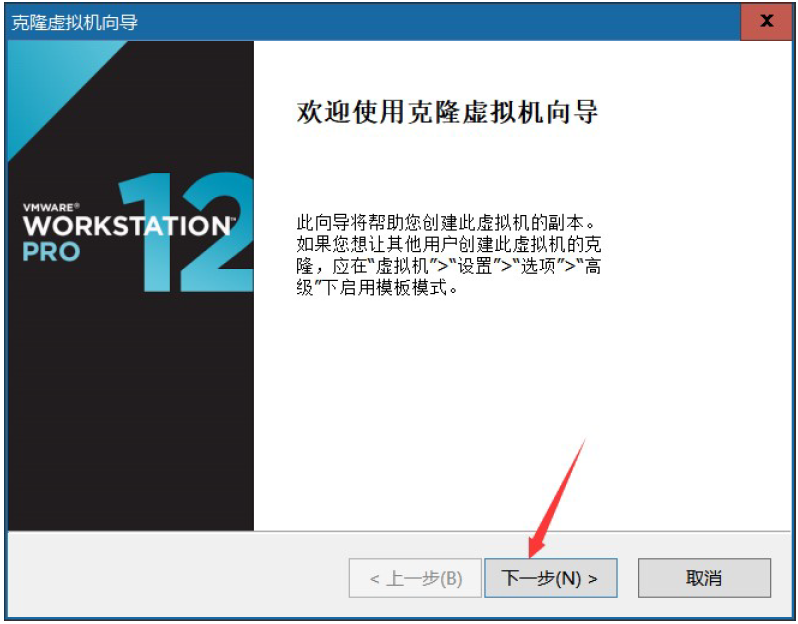
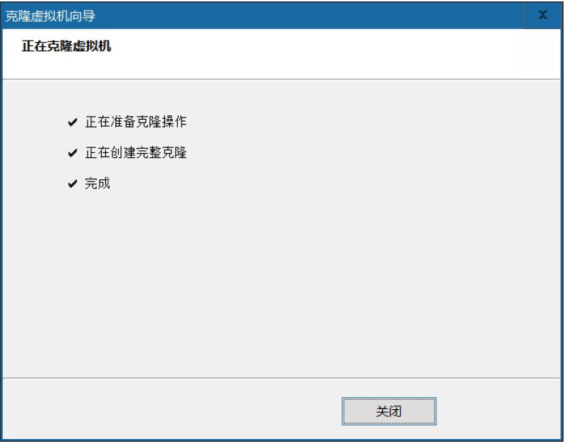
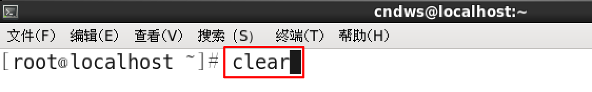
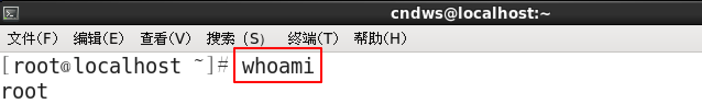

typora-copy-images-to: ./media

# Linux基础命令

# 学习目标

1、了解VMware备份的两种方式

2、能说出快照与克隆的区别

3、了解Linux系统文件

4、掌握Linux基础命令

5、知道vmware tools的作用

# 一、备份操作系统

在VMware中备份的方式有2 种：快照或克隆。

## 1、快照

快照：又称还原点，就是保存在拍快照时候的系统的状态（包含了所有的内容），在后期的时候随时可以恢复。

> 注意：侧重在于短期备份，需要频繁备份的时候都可以使用快照，做快照的时候虚拟机中操作系统一般处于开启状态

**快照：使用VMware实现快照，具体操作步骤，参考如下**

第一步：选中要拍摄快照的虚拟机，选择"虚拟机"菜单，点选“快照”中的“拍摄快照”


在对话框中填写基本的信息，之后点击“拍摄快照”即可。

第二步：对于快照进行管理（恢复、删除）

对快照的管理需要在"虚拟机" -> "快照" -> "快照管理器"中进行管理


## 2、克隆

克隆：就是复制的意思。

> 注意：克隆侧重长期备份，做克隆的时候是必须得关闭（了解）

**克隆：使用VMware实现克隆，具体操作步骤，参考如下**

先关机 –> 右键需要克隆的虚拟机 –> 管理 –> 克隆






克隆好的服务器相关密码帐号等信息与被克隆的系统一致。但是，克隆出来的机器网卡不能直接启动使用，需要配置。

## 3、快照与克隆的区别

克隆与快照的最大的区别：==克隆之后是2 台机器，而快照之后依旧是1 台机器（类似windows的还原点）。后期的危险操作前建议使用快照。==


# 二、Linux系统使用注意

## 1、Linux严格区分大小写

         Linux 和Windows不同，Linux严格区分大小写的，包括文件名和目录名、命令、命令选项、配置文件设置选项等。
         例如，Win7 系统桌面上有文件夹叫做Test，当我们在桌面上再新建一个名为 test 的文件夹时，系统会提示文件夹命名冲突；


​        Linux 系统不会，Linux 系统认为 Test ==文件==和 test ==文件==不是同一个==文件==，因此在 Linux 系统中，Test ==文件==和 test ==文件==可以位于同一目录下。

​        ==我们在操作 Linux 系统时要注意区分大小写的不同。==

## 2、Linux文件"扩展名"

​        我们都知道，Windows 是依赖扩展名区分文件类型的，比如，".txt" 是文本文件、".exe" 是执行文件，但 Linux 不是。
​        Linux 系统通过==权限位标识==来确定文件类型，常见的文件类型有普通文件、目录、链接文件、块设备文件、字符设备文件等几种。Linux 的可执行文件就是普通文件被赋予了可执行权限。


​        Linux 中的一些特殊文件还是要求写 "扩展名" 的，但 Linux 不依赖扩展名来识别文件类型，写这些扩展名是为了帮助运维人员来区分不同的文件类型。
​        这样的文件扩展名主要有以下几种：
​        **压缩包**：Linux 下常见的压缩文件名有 *.gz、*.bz2、*.zip、*.tar.gz、*.tar.bz2、*.tgz 等。
​        为什么压缩包一定要写扩展名呢？很简单，如果不写清楚扩展名，那么管理员不容易判断压缩包的格式，虽然有命令可以帮助判断，但是直观一点更加方便。就算没写扩展名，在 Linux 中一样可以解压缩，不影响使用。
​        **二进制软件包**：CentOS 中所使用的二进制安装包是 RPM 包，所有的 RPM 包都用".rpm"扩展名结尾，目的同样是让管理员一目了然。
​       **程序文件**：Shell 脚本一般用 ".sh" 扩展名结尾。
​       **网页文件**：网页文件一般使用 ".php" 等结尾，不过这是网页服务器的要求，而不是 Linux 的要求。


## 3、Linux中所有内容以文件形式保存

**Linux中，一切皆文件**

​       

**普通文件**，类似于windows中文件的概念，可以分为一般文件（黑色）和可执行文件（绿色）。

一般文件特点其打开（编辑器打开）后会看到里面有内容，或者可以往其中写内容。(黑色的)

可执行文件在Windows 下一般为exe、msi、bat 等后缀，其特点就是双击之后可以直接运行。（绿色的）


**目录文件**类似于Windows中的文件夹

用于存储文件（当然也可以存储文件夹）的夹子称之为文件夹。（天蓝色的）


## 4、Linux中所有存储设备都必须在挂载之后才能使用

​        **挂载**其实就是给这些存储设备==分配盘符==，只不过 Windows 中的盘符用英文字母表示，例如c:,d:,而 Linux 中的盘符则是一个已经建立的空目录。我们把这些空目录叫作**挂载点**（可以理解为 Windows 的盘符），把==设备文件（如 /dev/sdb）和挂载点（已经建立的空目录）连接的过程叫作挂载==。

​        ==挂载==过程是通过挂载命令实现的，具体的挂载命令后续会讲。

## 5、Linux系统的文件目录结构

​        Linux 系统不同于 Windows，没有 C 盘、D 盘、E 盘那么多的盘符，只有一个==根目录（/）==，所有的文件（资源）都存储在以==根目录（/）==为树根的==树形==目录结构中。

​        

​        在 Linux 根目录（/）下包含很多的子目录，称为一级目录。
​        例如 bin、boot、dev 等。
​        同时，各一级目录下还含有很多子目录，称为二级目录。
​        例如 /bin/bash、/bin/ed 等。


路径**：路径分为 绝对路径和相对路径。
**==绝对路径==**：不管当前工作路径是在哪，==目标路径都会从“/”磁盘根下开始==。
**相对路径**：除绝对路径之外的路径称之为相对路径，相对路径得有一个相对物（当前工作路径）。

只要看到路径以“/”开头则表示该路径是绝对路径，除了以“/”开头的路径称之为相对路径。

../：表示上级目录（上一级）

./ ：表示当前目录（同级），普通文件./可以省略，可执行文件（绿色）必须加./

文件夹名称/：表示下级目录（下一级），注意这个斜杠/

## 6、Linux系统的文件目录用途

​           Linux 基金会发布了 FHS （Filesystem Hierarchy Standard 文件系统层次化标准）。规定了主要文件夹的用途


| 一级目录 | 功能（作用）                                                 |
| -------- | ------------------------------------------------------------ |
| /bin/    | 存放系统命令，普通用户和 root 都可以执行。放在 /bin 下的命令在单用户模式下也可以执行 |
| /boot/   | 系统启动目录，保存与系统启动相关的文件，如内核文件和启动引导程序（grub）文件等 |
| /dev/    | 设备文件保存位置                                             |
| /etc/    | 配置文件保存位置。系统内所有采用默认安装方式（rpm 安装）的服务配置文件全部保存在此目录中，如用户信息、服务的启动脚本、常用服务的配置文件等 |
| /home/   | 普通用户的主目录（也称为家目录）。在创建用户时，每个用户要有一个默认登录和保存自己数据的位置，就是用户的主目录，所有普通用户的主目录是在 /home/ 下建立一个和用户名相同的目录。如用户 liming 的主目录就是 /home/liming |
| /lib/    | 系统调用的函数库保存位置                                     |
| /media/  | 挂载目录。系统建议用来挂载媒体设备，如软盘和光盘             |
| /mnt/    | 挂载目录。早期 Linux 中只有这一个挂载目录，并没有细分。系统建议这个目录用来挂载额外的设备，如 U 盘、移动硬盘和其他操作系统的分区 |
| /misc/   | 挂载目录。系统建议用来挂载 NFS 服务的共享目录。虽然系统准备了三个默认挂载目录 /media/、/mnt/、/misc/，但是到底在哪个目录中挂载什么设备可以由管理员自己决定。例如，笔者在接触 Linux 的时候，默认挂载目录只有 /mnt/，所以养成了在 /mnt/ 下建立不同目录挂载不同设备的习惯，如 /mnt/cdrom/ 挂载光盘、/mnt/usb/ 挂载 U 盘，都是可以的 |
| /opt/    | 第三方安装的软件保存位置。这个目录是放置和安装其他软件的位置，手工安装的源码包软件都可以安装到这个目录中。不过笔者还是习惯把软件放到 /usr/local/ 目录中，也就是说，/usr/local/ 目录也可以用来安装软件 |
| /root/   | root 的主目录。普通用户主目录在 /home/ 下，root 主目录直接在“/”下 |
| /sbin/   | 保存与系统环境设置相关的命令，只有 root 可以使用这些命令进行系统环境设置，但也有些命令可以允许普通用户查看 |
| /srv/    | 服务数据目录。一些系统服务启动之后，可以在这个目录中保存所需要的数据 |
| /tmp/    | 临时目录。系统存放临时文件的目录，在该目录下，所有用户都可以访问和写入。建议此目录中不能保存重要数据，最好每次开机都把该目录清理 |


​        FHS 针对根目录中包含的子目录仅限于上表，但除此之外，Linux 系统根目录下通常还包含下面几个一级目录。

| 一级目录     | 功能（作用）                                                 |
| ------------ | ------------------------------------------------------------ |
| /lost+found/ | 当系统意外崩溃或意外关机时，产生的一些文件碎片会存放在这里。在系统启动的过程中，fsck 工具会检查这里，并修复已经损坏的文件系统。这个目录只在每个分区中出现，例如，/lost+found 就是根分区的备份恢复目录，/boot/lost+found 就是 /boot 分区的备份恢复目录 |
| /proc/       | 虚拟文件系统。该目录中的数据并不保存在硬盘上，而是保存到内存中。主要保存系统的内核、进程、外部设备状态和网络状态等。如 /proc/cpuinfo 是保存 CPU 信息的，/proc/devices 是保存设备驱动的列表的，/proc/filesystems 是保存文件系统列表的，/proc/net 是保存网络协议信息的...... |
| /sys/        | 虚拟文件系统。和 /proc/ 目录相似，该目录中的数据都保存在内存中，主要保存与内核相关的信息 |

# 三、Linux命令入门

## 1、开启终端

问题：后期Linux 服务器都是以纯命令行的形式运行的，那在桌面模式下是否有命令输入的地方？

答：有，可以使用==终端==输入命令，在顶部单击应用程序菜单，选择系统工具，选择终端即可。


运行结果如下图所示：


## 2、命令与选项

什么是Linux 的命令？

答：就是指在Linux 终端（命令行）中输入的内容就称之为命令。


一个完整的命令的标准格式：Linux 通用的格式

#命令（空格） [选项]（空格）[参数]

```powershell
#ls

#ls -l

#tail -n 3 readme.txt
```

注意：后期被"[]"包裹的表示该项为可选项，可写可不写，具体得看需要一个命令可以包含多个选项。操作对象也可以是多个。

## 3、Linux命令补全

​        在 Linux 系统中，当你输入一个命令，再按两次 TAB 键，就会列出所有以你输入字符开头的可用命令。这个功能被称作命令行补全。


# 四、Linux基础命令

以下相关命令操作，建议使用超级管理员root进行实现，使用root用户登录linux

```powershell
#su - root
```

## 1、uname查看操作系统信息

命令：uname [参数]

作用：获取计算机操作系统相关信息

参数：-a，选项-a代表all，表示获取全部的系统信息（类型、全部主机名、内核版本、发布时间、开源计划）

```powershell
用法一：直接输入uname 或者 uname -a
示例代码：
#uname
#uname -a
含义：获取操作系统的信息
```


## 2、ls命令查看目录下文件

ls（完整写法=>list show）列出,列表

```powershell
用法一：直接输入ls
示例代码：
#ls
含义：列出当前工作路径下的文件名称
```

示例代码：


```powershell
用法二：# ls 后面跟绝对路径，列出某个路径下的文件名
示例代码：
#ls /var/log/
含义：列出/var/log/目录下的文件名称

```


```powershell
用法三：# ls 后面跟相对路径，列出某个路径下的文件名
示例代码：
#ls anaconda/
含义:列出当前工作路径下，anaconda目录下的文件名
```


```powershell
用法四：#ls 后面跟参数选项 跟路径
含义：在列出指定路径下的文件/文件夹的名称，并以指定的格式进行显示。

常见的参数选项：
-l：表示list，表示以详细列表的形式进行展示
-a：all，表示显示所有的文件/文件夹（包含了隐藏文件/文件夹）
-h：表示以较高可读性（文档大小）的形式进行展示

示例代码：
#ls -l

#ls -a

#ls -la

#ls -lh
在Linux 命令语法中，多个选项可以合并写成-abcdef 这种形式,例如-l和-a可以合并写成-la
```


特别说明：

```powershell
在Linux 中隐藏文档一般都是以"."开头
    "."表示当前路径
    ".."表示上级路径（相对当前路径）

注意第一列的第一个字符，该位表示文档类型，“d”表示文件夹，“-”表示是文件

文件&文件夹在ls结果中所表示的颜色是不一样的，文件夹的颜色一般都是蓝色的，文件一般都是黑色的（所说的颜色均是指在终端中的默认颜色）
```


​        需要注意：单位不一定是k，系统会在获取其大小之后为文档找到一个合适的单位，因此单位可是“K”、“M”、“G”、“T”其中之一。


```powershell
用法五：将ls -l进行简写
示例代码：
#ll

ll等价于"ls -l"
```


LS命令总结：

```powershell
#ls    查看当前目录下的文件  

#ls /usr/local    查看指定路径下的文件，路径为/usr/local

#ls -l /usr/local    以详细信息的方式查看/usr/local下的文件

#ls -la /usr/local      以详细信息的方式，查看/usr/local下的所有文件，包含隐藏文件

#ll    ls -l

#ls -lh  高可读性方式查看
```

​    


## 3、pwd命令 显示当前路径

命令：（print working directory)打印当前工作目录

```powershell
用法：直接输入pwd
示例代码：
#pwd
含义：告诉用户当前所在的路径
```


## 4、cd命令 切换目录

命令： cd （==change directory==，改变目录）

作用：用于切换当前的工作目录的

```powershell
用法：#cd [路径]
示例代码：

#cd /usr/local/
含义：切换到/usr/local/目录下

#cd
含义：切换到当前用户的家目录

#cd ~
含义：切换到当前用户的家目录

#cd ../
含义：切换到上一级目录

```

说明：路径是可以写也可以不写，写路径的话则表示切换到指定路径，如果不写表示切换到当前登录用户的家目录中。


特别用法说明：在Linux 中有一个特殊的符号“~”，表示当前用户的家目录，等价于直接cd。

切换的方式：# cd ~ 【表示切换到当前用户家目录中】


## 5、clear命令 清除屏幕信息

命令： clear

作用：用于清除终端信息（清屏）

```powershell
用法：直接输入clear回车
示例代码：
#clear
含义：清除屏幕信息
```



## 6、whoami命令 显示当前用户

命令： whoami

作用：用户获取当前用户的用户名

```powershell
用法：直接输入whoami回车
示例代码：
#whoami
含义：获取当前用户的用户名
```





## 7、reboot命令 重启操作系统

命令： reboot

作用：重启操作系统

```powershell
用法：输入reboot回车
示例代码：
#reboot
含义：重启操作系统
```


##  8、shutdown命令 关闭操作系统

命令： shutdown

作用：关机命令

```powershell
用法一：输入shutdown回车
示例代码：
#shutdown
含义：使系统在60秒后关机

```


```powershell
用法二：输入shutdown加参数
-h 加数字：数字代表秒数，在某个时间后关机，如果数字为0，表示立即关机
now：表示立即关机

示例代码：
#shutdown -h 20
含义：延迟关机，使系统在20分后关机
说明：当我们执行延迟关机shutdown  -h  20这个命令时，系统就处于关机等待状态。如果后悔了想取消关机，可以输入shutdown -c取消

示例代码：
#shutdown now
含义：立即关机
```


```powershell
用法三：shutdown加-r参数重启计算机

示例代码：
#shutdown -r 60			
含义：延迟重启，60分之后重启

#shutdown -r now
含义：立即重启

说明：重启等待期间，仍然可以使用shutdown -c取消操作
```


扩展命令：halt命令

```powershell
在实际应用中，我们也可以直接使用halt命令进行关机操作。
基本语法：
# halt -p
以上命令相当于"shutdown  -h   0"，代表立即关机
```


shutdown命令总结

```powershell
#shutdown now   立即关机

#shutdown -h 0   立即关机

#shutdown -h 60    延时关机，60分钟

#延时50秒关机 用什么命令？

#shutdown -r 0     立即重启

#shutdown -r 60    延时重启
```


## 9、type命令 查看内部命令

命令：type

作用：查看一个命令是属于内部命令还是外部命令。

```powershell
用法：type 加命令 
示例代码：
#type cd
含义：查看命令属于内部命令还是外部命令
```


## 10、history命令 查看历史命令

命令：history

作用：列出最近输入的一千条命令信息

```powershell
用法：输入history回车
示例代码：
#history
含义：列出最近输入的一千条命令信息
```


## 11、hostnamectl主机名命令

Centos6中

查看主机名：#hostname

临时更改主机名：#hostname 临时主机名

永久更改主机名：编辑/etc/sysconfig/network文件，在文件中定义永久主机名


Centos7中主机名分3类，静态的（static）、瞬态的（transient）、和灵活的（pretty）。

​        **静态**主机名也称为内核主机名，是系统在启动时从/etc/hostname内自动初始化的主机名。相当于**永久更改**
​        **瞬态**主机名是在系统运行时临时分配的主机名，相当于**临时更改**
​        **灵活**主机名则允许使用特殊字符的主机名，例如"MaYun's Host"

​        CentOS 7中和主机名有关的文件为/etc/hostname，它是在系统初始化的时候被读取的，并且内核根据它的内容设置瞬态主机名。


命令：hostnamectl 

作用：操作服务器的主机名（读取、设置）

### 1）查看主机名

```powershell
用法：输入hostnamectl回车
示例代码：
#hostnamectl
含义：查看主机名信息
```


### 2）同时设置静态和瞬时主机名

```powershell
用法：输入hostnamectl set-hostname 主机名
示例代码：
#hostnamectl set-hostname heimaserver01.itcast.cn
含义：设置主机名称为heimaserver01.itcast.cn
注意：此设置影响静态和瞬态的主机名
```


### 3）分别配置静态，瞬时，灵活主机名

```powershell
用法：输入hostnamectl --pretty set-hostname 主机名
示例代码：
#hostnamectl --pretty set-hostname "yunwei's server01"
含义：单独设置 灵活 主机名称为 yunwei's server01
注意：
主机名需要用引号引起来
如果试图给静态或者瞬态，设置不规范的主机名称，命令可以执行，但是系统会自动去掉不允许的特殊字符
如果要单独设置静态或者瞬态主机名，只需要单独使用--static和--transient参数即可
```


静态主机名：聂程良服务器

灵活主机名：聂程良的服务器

灵活主机名允许使用"的"这个字


4）通过配置文件修改主机名

可以修改/etc/hostname来更改静态主机名，后面我们会讲如何编辑文件，这里大家知道就好


1.软件卸载重装（重新设置）

2.重装系统

3.冷静自己   ①

4.慢慢看一下是哪里操作失误

5.关机重启(生产环境，不要上来就重启) ②

6.查日志


# 五、扩展：VMware Tools安装(了解)

## 1、什么是VMware Tools

驱动与实用工具的集合

## 2、安装VMware Tools

第一步：找到VMware Tools菜单，如下图所示：


第二步：查看VMware Tools光驱图标是否显示：

 

第三步：打开CentOS系统的终端（类似DOS窗口）


> 如果使用普通用户登录操作系统，必须切换到超级管理员root。
>
> ```powershell
> $su root
> ```
>
> 注：-代表减号

第四步：找到VMware Tools所在路径，一般是在/media目录下：

```powershell
#cd /run/media/root/ + Tab键，自动补全
```

> 在Linux系统中，如果我们不记得某个命令或者不记得某个路径或名称，不要担心，只需要输入前几个字母 + Tab键，系统会自动帮助我们补全。

第五步：输入ls命令，查看当前目录下有哪些文件

```powershell
#ls
```


第六步：使用cp命令，把文件复制到/root目录下（自己的家里）

```powershell
#cp VM + Tab键 /root/
```

注意:Linux区分大小写，所以这里大写的VM补全，就会自动补全成VMwareTools-10.0.5-3228253.tar.gz

第七步：回到自己的家目录(/root)，使用cd命令

```powershell
#cd ~
```

第八步：使用tar命令解压.tar.gz文件

```powershell
#tar  -xvf   VM+Tab键
```

第九步：使用cd命令进入vmware-tools-distrib目录

```powershell
#cd vmware-tools-distrib
```

第十步：执行安装文件

```powershell
#./vmware-install.pl
一路回车
```

第十一步：执行重启命令

```powershell
#reboot
```


```powershell
    6  df -T    查看光盘挂载到哪个目录了
    7  cd /media/VMware\ Tools/   进入到挂载的目录
    8  ll   查看/media/VMware\ Tools/下有什么文件
    9  cp VMwareTools-10.3.10-13959562.tar.gz /usr/local/   把文件拷贝到/usr/local
   10  cd /usr/local/    进入到/usr/local目录
   11  ll  查看/usr/local/有什么
   12  tar xvf VMwareTools-10.3.10-13959562.tar.gz    TAR命令解压缩
   13  ll   查看生产的解压缩目录
   14  cd vmware-tools-distrib/   进入解压缩目录
   15  ll    查看vmware-tools-distrib目录里面有什么文件
   16  ./vmware-install.pl    执行文件vmware-install.pl
   17  reboot     重启
   18  history    查看历史命令
```
