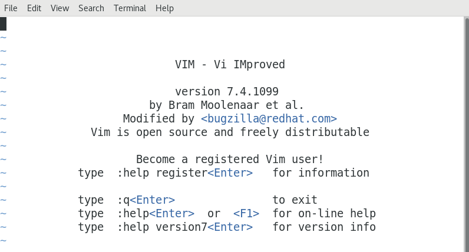
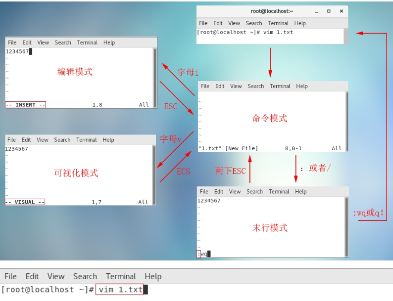
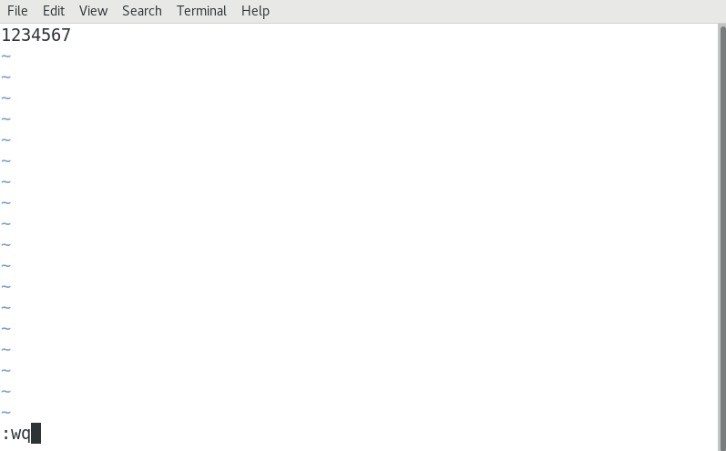
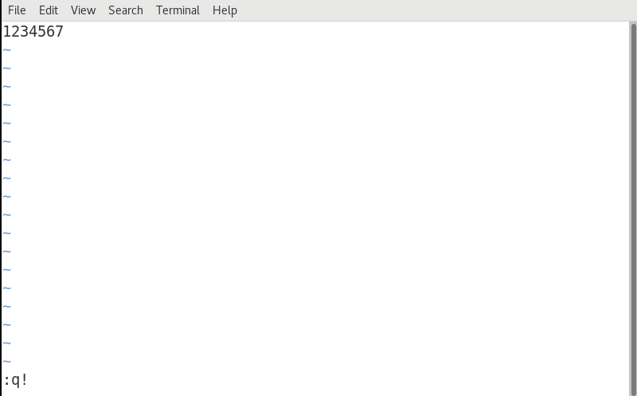
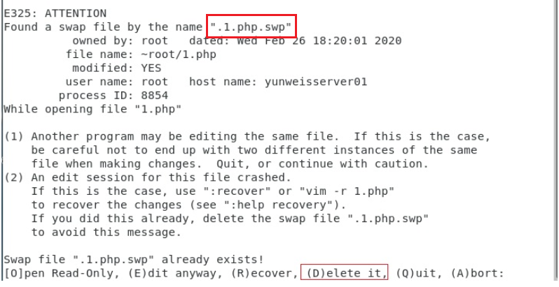

# Linux文件管理（上）

# 一、VIM编辑器

## 1、vi概述

 vi（visual editor）编辑器通常被简称为vi，它是Linux和Unix系统上最基本的文本编辑器，类似于Windows 系统下的notepad（记事本）编辑器。

## 2、vim编辑器

Vim(Vi improved)是vi编辑器的加强版，比vi更容易使用。vi的命令几乎全部都可以在vim上使用。

## 3、vim编辑器的安装

### ☆ 已安装

Centos通常都已经默认安装好了 vi 或 Vim 文本编辑器，我们只需要通过vim命令就可以直接打开vim编辑器了，如下图所示：



### ☆ 未安装

有些精简版的Linux操作系统，默认并没有安装vim编辑器（可能自带的是vi编辑器）。当我们在终端中输入vim命令时，系统会提示"command  not  found"。

解决办法：有网的前提下，可以使用yum工具对vim编辑器进行安装

```powershell
# yum install vim -y
```

## 4、vim编辑器的四种模式（重点）

### ☆ 命令模式

使用VIM编辑器时，==默认处于命令模式。==在该模式下可以移动光标位置，可以通过==快捷键==对文件==内容==进行复制、粘贴、删除等操作。

### ☆ 编辑模式或输入模式

在命令模式下输入小写字母a或小写字母i即可进入编辑模式，在该模式下可以对文件的内容进行编辑

### ☆ 末行模式

在命令模式下输入冒号:即可进入末行模式，可以在==末行输入命令==来对文件进行查找、替换、保存、退出等操作

### ☆ 可视化模式（了解）

可以做一些列选操作（通过方向键选择某些列的内容）

# 二、VIM四种模式的关系

## 1、VIM四种模式

命令模式/编辑模式/末行模式/可视化模式

## 2、VIM四种模式的关系



# 三、VIM编辑器的使用

## 1、使用vim打开文件

基本语法：

```powershell
# vim  文件名称
```

① 如果文件已存在，则直接打开

② 如果文件不存在，则vim编辑器会自动在内存中创建一个新文件

案例：使用vim命令打开readme.txt文件

```powershell
# vim readme.txt
```

## 2、vim编辑器保存文件

在任何模式下，连续按两次Esc键，即可返回到命令模式。然后按冒号：，进入到末行模式，输入wq，代表保存并退出。



## 3、vim编辑器强制退出（不保存）

在任何模式下，连续按两次Esc键，即可返回到命令模式。然后按冒号：，进入到末行模式，输入q!，代表强制退出但是不保存文件。



## 4、命令模式下的相关操作（重点）

### ☆ 如何进入命令模式

答：在Linux操作系统中，当我们使用vim命令直接打开某个文件时，默认进入的就是命令模式。如果我们处于其他模式（编辑模式、可视化模式以及末行模式）可以连续按两次Esc键也可以返回命令模式

### ☆ 命令模式下我们能做什么

① 移动光标 ② 复制 粘贴 ③ 剪切 粘贴 删除 ④ 撤销与恢复

### ☆ 移动光标到首行或末行（重点）

移动光标到首行 => gg

移动光标到末行 => G

### ☆ 翻屏

向上    翻屏，按键：`ctrl + b （before） 或 PgUp`

向下    翻屏，按键：`ctrl + f （after）  或 PgDn`

向上翻半屏，按键：`ctrl + u （up）`

向下翻半屏，按键：`ctrl + d （down）`

### ☆ 快速定位光标到指定行（重点）

行号 + G，如150G代表快速移动光标到第150行。

### ☆ 复制/粘贴（重点）

① 复制当前行（光标所在那一行）

按键：yy

粘贴：在想要粘贴的地方按下p 键【将粘贴在光标所在行的下一行】,如果想粘贴在光标所在行之前，则使用P键

② 从当前行开始复制指定的行数，如复制5行，5yy

粘贴：在想要粘贴的地方按下p 键【将粘贴在光标所在行的下一行】,如果想粘贴在光标所在行之前，则使用P键

### ☆ 剪切/删除（重点）

在VIM编辑器中，剪切与删除都是dd

如果剪切了文件，但是没有使用p进行粘贴，就是删除操作

如果剪切了文件，然后使用p进行粘贴，这就是剪切操作

① 剪切/删除当前光标所在行

按键：dd （删除之后下一行上移）

粘贴：p

注意：dd 严格意义上说是剪切命令，但是如果剪切了不粘贴就是删除的效果。

② 剪切/删除多行（从当前光标所在行开始计算）

按键：数字dd

粘贴：p

特殊用法：

③ 剪切/删除光标所在的当前行（光标所在位置）之后的内容，但是删除之后下一行不上移

按键：D （删除之后当前行会变成空白行）

### ☆ 撤销/恢复（重点）

撤销：u（undo）

恢复：ctrl + r 恢复（取消）之前的撤销操作【重做，redo】

## 总结

① 怎么进入命令模式（vim 文件名称，在任意模式下，可以连续按两次Esc键即可返回命令模式）

② 命令模式能做什么？移动光标、复制/粘贴、剪切/删除、撤销与恢复

首行 => gg，末行 => G  翻屏（了解） 快速定位 行号G，如150G

yy  p   5yy  p

dd p   5dd p

u

ctrl + r

## 5、末行模式下的相关操作（重点）

### ☆ 如何进入末行模式

进入末行模式的方法只有一个，在命令模式下使用冒号：的方式进入。

### ☆ 末行模式下我们能做什么

文件保存、退出、查找与替换、显示行号、paste模式等等

### ☆ 保存/退出（重点）

:w => 代表对当前文件进行保存操作，但是其保存完成后，并没有退出这个文件

:q => 代表退出当前正在编辑的文件，但是一定要注意，文件必须先保存，然后才能退出

:wq => 代表文件先保存后退出（保存并退出）

如果一个文件在编辑时没有名字，则可以使用:wq  文件名称，代表把当前正在编辑的文件保存到指定的名称中，然后退出

:q! => 代表强制退出但是文件未保存（不建议使用）

### ☆ 查找/搜索（重点）

切换到命令模式，然后输入斜杠/（也是进入末行模式的方式之一）

进入到末行模式后，输入要查找或搜索的关键词，然后回车

如果在一个文件中，存在多个满足条件的结果。在搜索结果中切换上/下一个结果：N/n （大写N代表上一个结果，小写n代表next）

如果需要取消高亮，则需要在末行模式中输入`:noh`【no highlight】

### ☆ 文件内容的替换（重点）

第一步：首先要进入末行模式（在命令模式下输入冒号:）

第二步：根据需求替换内容

① 只替换光标所在这一行的第一个满足条件的结果（只能替换1次）

```powershell
:s/要替换的关键词/替换后的关键词   +  回车
```

案例：把hello centos中的centos替换为centos7.6

```powershell
切换光标到hello centos这一行
:s/centos/centos7.6
```

② 替换光标所在这一行中的所有满足条件的结果（替换多次，只能替换一行）

```powershell
:s/要替换的关键词/替换后的关键词/g		g=global全局替换
```

案例：把hello centos中的所有centos都替换为centos7.6

```powershell
切换光标到hello centos这一行
:s/centos/centos7.6/g
```

③ 针对整个文档中的所有行进行替换，只替换每一行中满足条件的第一个结果

```powershell
:%s/要替换的关键词/替换后的关键词
```

案例：把每一行中的第一个hello关键词都替换为hi

```powershell
:%s/hello/hi
```

④ 针对整个文档中的所有关键词进行替换（只要满足条件就进行替换操作）

```powershell
:%s/要替换的关键词/替换后的关键词/g
```

案例：替换整个文档中的hello关键词为hi

```powershell
:%s/hello/hi/g
```

### ☆ 显示行号

基本语法：

```powershell
:set nu
nu = number，行号
```

> 取消行号 => :set  nonu

### ☆ set paste模式(了解)

为什么要使用paste模式？

问题：在终端Vim中粘贴代码时，发现插入的代码会有多余的缩进，而且会逐行累加。原因是终端把粘贴的文本存入键盘缓存（Keyboard Buffer）中，Vim则把这些内容作为用户的键盘输入来处理。导致在遇到换行符的时候，如果Vim开启了自动缩进，就会默认的把上一行缩进插入到下一行的开头，最终使代码变乱。

在粘贴数据之前，输入下面命令开启paste模式
:set paste

粘贴完毕后，输入下面命令关闭paste模式
:set nopaste

## 总结

① 如何进入末行模式，必须从命令模式中使用冒号进行切换

② 末行模式下能做什么？保存、退出、查找、替换、显示行号以及paste模式

③ 保存 => :w

④ 退出 => :q，先保存后退出。:wq     :wq  文件名称    :q!

⑤ 查找功能 => 命令模式输入/斜杠  +  关键词（高亮显示）=> :noh

⑥ 替换功能

:s/要替换的关键词/替换后的关键词

:s/要替换的关键词/替换后的关键词/g

:%s/要替换的关键词/替换后的关键词

:%s/要替换的关键词/替换后的关键词/g

⑦ 显示行号 => :set nu 取消行号 => :set nonu

⑧ paste模式 => 将来在粘贴代码的时候为了保存原格式 => 粘贴之前 => :set paste

# 四、编辑模式

## 1、编辑模式的作用

编辑模式的作用比较简单，主要是实现对文件的内容进行编辑模式。

## 2、如何进入编辑模式

首先你需要进入到命令模式，然后使用小写字母a或小写字母i，进入编辑模式。

命令模式 + i  ： insert缩写，代表在光标之前插入内容

命令模式 + a ： append缩写，代表在光标之后插入内容

## 3、退出编辑模式

在编辑模式中，直接按Esc，即可从编辑模式退出到命令模式。

# 五、可视化模式

## 1、如何进入到可视化模式

在命令模式中，直接按ctrl + v（可视块）或V（可视行）或v（可视），然后按下↑  ↓  ←  →方向键来选中需要复制的区块，按下y 键进行复制（不要按下yy），最后按下p 键粘贴

退出可视模式按下Esc

## 2、可视化模式复制操作

第一步：在命令模式下，直接按小v，进入可视化模式

第二步：使用方向键↑  ↓  ←  →选择要复制的内容，然后按y键

第三步：移动光标，停在需要粘贴的位置，按p键进行粘贴操作

## 3、为配置文件添加#多行注释（重点）

第一步：按Esc退出到命令模式，按gg切换到第1行

第二步：然后按Ctrl+v进入到可视化区块模式（列模式）

第三步：在行首使用上下键选择需要注释的多行

第四步：按下键盘（大写）“I”键，进入插入模式（Shift + i）

第五步：输入#号注释符

第六步：输入完成后，连续按两次Esc即可完成添加多行注释的过程

## 4、为配置文件去除#多行注释（重点）

第一步：按Esc退出到命令模式，按gg切换到第1行

第二步：然后按Ctrl+v进入可视化区块模式（列模式）

第三步：使用键盘上的方向键的上下选中需要移除的#号注释

第四步：直接按Delete键即可完成删除注释的操作

# 六、VIM编辑器实用功能

## 1、代码着色

之前说过vim 是vi 的升级版本，其中比较典型的区别就是vim 更加适合coding，因为vim比vi 多一个代码着色的功能，这个功能主要是为程序员提供编程语言升的语法显示效果，如下：

第一步：定义后缀名为网页文件的代码文件

```powershell
# vim index.php
```

第二步：编写对应的PHP代码

```powershell
<?php
	echo 'hello world';
?>
```

在VIM编辑器中，我们可以通过`:syntax on`或`:syntax off`开启或关闭代码着色功能。

## 2、异常退出解决方案

什么是异常退出：在编辑文件之后并没有正常的去wq（保存退出），而是遇到突然关闭终端或者断电的情况，则会显示下面的效果，这个情况称之为异常退出：



> 温馨提示：每个文件的异常文件都会有所不同，其命名规则一般为`.文件名称.swp`

解决办法：将交换文件（在编程过程中产生的临时文件）删除掉即可【在上述提示界面按下D 键或者使用rm 指令删除交换文件】

```powershell
# rm .1.php.swp
```

## 3、退出vim编辑器

回顾：在vim中，退出正在编辑的文件可以使用`:q`或者`:wq`

除了上面的这个语法之外，vim 还支持另外一个保存退出(针对内容)方法`:x`

① `:x`在文件没有修改的情况下，表示直接退出（等价于:q），在文件修改的情况下表

示保存并退出（:wq）


② 如果文件没有被修改，但是使用wq 进行退出的话，则文件的修改时间会被更新；但是如果文件没有被修改，使用x 进行退出的话，则文件修改时间不会被更新的；主要是会混淆用户对文件的修改时间的认定。

# 七、查看文件的内容

## 1、cat命令

### ☆ 输出文件内容

基本语法：

```powershell
# cat 文件名称
111
222
333
444
```

主要功能：正序输出文件的内容

### ☆ 合并多个文件内容

基本语法：

```powershell
# cat 文件名称1  文件名称2  ... > 合并后的文件名称
```

主要功能：把文件名称1、文件名称2、...中的内容的合并到一个文件中

## 2、tac命令

基本语法：

```powershell
# tac 文件名称
444
333
222
111
```

主要功能：倒序输出文件的内容

## 3、head命令

基本语法：

```powershell
# head -n 文件名称
```

主要功能：查看一个文件的前n 行，如果不指定n，则默认显示前10 行

案例：查询linux.txt文件中的前10行

```powershell
# head linux.txt
```

案例：查询linux.txt文件中的前3行

```powershell
# head -3 linux.txt
```

## 4、tail命令

基本语法：

```powershell
# tail -n 文件名称
```

主要功能：查看一个文件的最后n 行，如果不指定n，则默认显示最后10 行

案例：查询linux.txt文件的最后10行

```powershell
# tail linux.txt
```

案例：查询linux.txt文件的最后3行

```powershell
# tail -3 linux.txt
```

## 5、tail -f命令

基本语法：

```powershell
# tail  -f  文件名称
```

主要功能：动态查看一个文件内容的输出信息（主要用于将来查询日志文件的变化）

案例：查询系统的/var/log/messages文件的日志信息

```powershell
# tail -f /var/log/messages
```

退出方式可以直接按快捷键：Ctrl + C，中断操作

