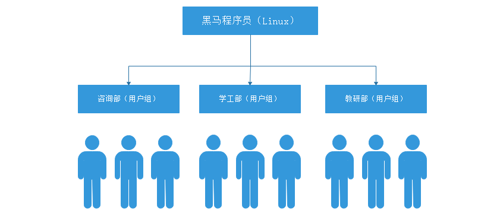

# Linux文件管理与用户管理

# 一、查看文件内容

## 1、回顾之前的命令

cat命令、tac命令、head命令、tail命令、扩展：tail  -f动态查看一个文件的内容

## 2、more分屏显示文件内容（了解）

基本语法：

```powershell
# more 文件名称
```

> 特别注意：more命令在加载文件时并不是一点一点进行加载，而是打开文件时就已经把文件的全部内容加载到内存中了。如果打开文件较大，则可能会出现卡顿情况。

more命令拥有一些交互功能，可以通过快捷键进行操作这个more的阅读器。

| 回车键 | 向下移动一行。                                       |
| ------ | ---------------------------------------------------- |
| d      | 向下移动半页。                                       |
| 空格键 | 向下移动一页。                                       |
| b      | 向上移动一页，后期引入功能，早期more只能前进不能后退 |
| q      | 退出   more。                                        |

> 早期more命令没有现在这么强大，其只能前进不能后退

## 3、less分屏显示文件内容（重点）

基本语法：

```powershell
# less 文件名称
```

> 特别注意：less命令不是加载整个文件到内存，而是一点一点进行加载，相对而言，读取大文件时，效率比较高。

另外：less可以通过上下方向键显示上下内容，退出时不会在Shell中留下刚显示的内容

less 命令的执行也会打开一个交互界面，下面是一些常用交互命令（和more类似）：

| 按键             | 功能                               |
| ---------------- | ---------------------------------- |
| 回车键           | 向下移动一行。                     |
| d                | 向下移动半页。                     |
| 空格键           | 向下移动一页。                     |
| b                | 向上移动一页。                     |
| 上下方向键       | 向上与向下移动，less命令特有功能键 |
| less -N 文件名称 | 显示行号                           |
| / 字符串         | 搜索指定的字符串。                 |
| q                | 退出less                           |

cat,more,less三者的对比：

|            | cat                  | more                   | less                   |
| ---------- | -------------------- | ---------------------- | ---------------------- |
| 作用       | 显示小文件(一屏以内) | 显示大文件（超过一屏） | 显示大文件（超过一屏） |
| 交互命令   | 无                   | 有                     | 有                     |
| 上下键翻行 | 无                   | 无                     | 有                     |

# 二、文件统计命令

## 1、wc命令

基本语法：

```powershell
# wc [选项] 文件名称
选项说明：
-l：表示lines，行数（以回车/换行符为标准）
-w：表示words，单词数 依照空格来判断单词数量
-c：表示bytes，字节数（空格，回车，换行）
```

案例：统计linux.txt文件的总行数

```powershell
# wc -l linux.txt
```

案例：统计linux.txt文件中的单词数

```powershell
# wc -w linux.txt
```

案例：统计文件的字节数（数字、字母一般1个字符=1个字节，中文和编码格式有关，如utf-8编码格式，1个汉字占用3个字节）

```powershell
# wc -c linux.txt
```

> 扩展：wc  [选项]  文件的名称可以统计一个文件的信息，实际情况下，我们选项还可以一起使用

案例：统计一个文件的总行数、总单词数以及总字节数

```powershell
# wc -wlc linux.txt
或
# wc -lwc linux.txt
或
# wc -clw linux.txt
```

## 2、du命令

基本语法：

```powershell
# du [选项] 统计的文件或文件夹
选项说明：
-s ：summaries，只显示汇总的大小，统计文件夹的大小
-h ：以较高的可读性显示文件或文件夹的大小，（KB/MB/GB/TB)
```

主要功能：查看文件或目录(会递归显示子目录)占用磁盘空间大小

案例：显示readme.txt文件的大小（占用磁盘空间，不显示文件大小的单位）

```powershell
# du readme.txt
```

案例：显示readme.txt文件的大小（占用磁盘空间，显示文件大小的单位）

```powershell
# du -h readme.txt
```

案例：统计wechat文件夹的大小

```powershell
# du -sh wechat
```

案例：统计/etc目录的大小

```powershell
# du -sh /etc
```

# 三、文件处理命令

## 1、find命令

基本语法：

```powershell
# find 搜索路径 [选项]
选项说明：
-name：指定要搜索文件的名称，支持*星号通配符（Shift + 8）
-type：代表搜索的文件类型，f代表普通文件，d代表文件夹=>加快检索速度
```

主要功能：当我们查找一个文件时，必须使用的一个命令。

案例：搜索/var目录中boot.log文件（普通文件）

```powershell
# find /var -name "boot.log" -type f
```

案例：全盘搜索ssh目录

```powershell
# find / -name "ssh" -type d 
```

> 特别注意：实际工作时，尽量减少全盘检索，比较消耗资源

扩展功能：find实现模糊查询（必须结合通配符）

案例：搜索/var/log目录下的所有的以".log"结尾的文件信息

```powershell
# find /var/log -name "*.log" -type f
```

> \* ：通配符，代表任意个任意字符。如*.log代表以.log结尾的文件，apache\*代表搜索以apache开头的文件信息

## 2、grep命令

基本语法：

```powershell
# grep [选项] 要搜索的关键词 搜索的文件名称
选项说明：
-n ：代表显示包含关键词的行号信息
```

单位：行，一行一行向下搜索

主要功能：在文件中直接找到包含指定关键词的那些行，并把这些信息高亮显示出来

案例：在initial-setup-ks.cfg文件中搜索包含关键词"network"的行

```powershell
# grep network initial-setup-ks.cfg
```

案例：在initial-setup-ks.cfg文件中搜索包含关键词"network"的行，然后显示行号信息

```powershell
# grep -n network initial-setup-ks.cfg
```

扩展语法：

```powershell
# grep 要搜索的关键词 多个文件的名称
```

主要功能：在多个文件中查找包含指定关键词的那些行，并高亮显示出来

案例：搜索/var/log目录下所有文件，找到包含关键词"network"的所有行信息

```powershell
# grep network /var/log/*
```

## 3、echo命令

基本语法：

```powershell
# echo "文本内容"
```

主要功能：在终端中输入指定的文本内容

案例：在终端中，输出hello world字符串

```powershell
# echo "hello world"
```

## 4、输出重定向

场景：一般命令的输出都会显示在终端中，有些时候需要将一些命令的执行结果想要保存到文件中进行后续的分析/统计，则这时候需要使用到的输出重定向技术。

\>  ：标准输出重定向 : 覆盖输出，会覆盖掉原先的文件内容

\>>：追加重定向 : 追加输出，不会覆盖原始文件内容，会在原始内容末尾继续添加

案例：把echo输出的"hello world"写入到readme.txt文件中

```powershell
# echo "hello world" > readme.txt
```

以上程序的主要功能代表把echo命令的执行结果，输出写入到readme.txt文件中，如果readme.txt文件中存在内容，则首先清空，然后在写入hello world


案例：把echo输出的"hello linux"写入到readme.txt，要求不能覆盖原来的内容

```powershell
# echo "hello linux" >> readme.txt
```

# 四、Linux操作系统用户和组的概念

## 1、为什么需要了解用户和组

服务器要添加多账户的作用

​        针对不同用户分配==不同的权限==，不同权限可以限制用户==可以访问到的系统资源==
​        提高系统的安全性
​        帮助系统管理员对使用系统的用户进行跟踪

## 2、用户和组的关系



理论上Linux系统中的每个用户在创建时都应该有一个对应的用户组，这个组就称之为用户的主组。同时，有些情况下，某个用户需要临时使用某个组的权限，那这个组就称之为这个用户的附属组或附加组。

> 主组只能拥有一个，但是附属组或附加组可以同时拥有多个 =>  亲爹，干爹（多个）

## 3、用户组操作

用户组的操作无疑三件事：用户组的添加、用户组的修改以及用户组的删除操作

组：group

添加：add

修改：mod

删除：del

### ☆ 用户组的添加

基本语法：

```powershell
# groupadd [选项]  用户组的组名称
选项说明：
-g ：代表用户组的组ID编号，自定义组必须从1000开始，不能重复
```

案例：在系统中添加一个hr的用户组

```powershell
# groupadd hr
```

案例：在系统中添加一个test的用户组并指定定编号1100

```powershell
# groupadd -g 1100 test
```

问题：我们刚才创建的hr以及test用户组到底添加到哪里了？

答：默认情况下，我们添加的用户组都会放在一个系统文件中，文件位置=>/etc/group

```powershell
# tail -3 /etc/group
root:x:0:
itheima:x:1000:
```

### ☆ /etc/group文件解析

由以上命令的执行结果可知，在/etc/group文件中，其一共拥有三个冒号，共四列。每列含义：

```powershell
第一列：用户组的组名称
第二列：用户组的组密码，使用一个x占位符
第三列：用户组的组ID编号，1-999代表系统用户组的组编号，1000以后的代表自定义组的组编号
CentOS6 => 1-499,500...
CentOS7 => 1-999,1000...
第四列：用户组内的用户信息（如果一个用户的附属组或附加组为这个组名，则显示在此位置）
```

### ☆ 用户组的修改

基本语法：

```powershell
# groupmod [选项 选项的值] 原来组的组名称
选项说明：
-g ：gid缩写，设置一个自定义的用户组ID数字，1000以后
-n ：name缩写，设置新的用户组的名称
```

案例：把hr用户组更名为szhr

```powershell
# groupmod -n szhr hr
```

案例：把test用户组的组编号由1100更改为1003

```powershell
# groupmod -g 1003 test
```

案例：把itcast组的组名称更改为admin且用户组的组编号更改为1004

```powershell
# groupmod -g 1004 -n admin itcast
```

### ☆ 用户组的删除

基本语法：

```powershell
# groupdel 用户组名称
```

案例：使用groupdel删除test用户组

```powershell
# groupdel test
```

## 4、用户操作

用户：user

添加：add

修改：mod

删除：del

### ☆ 用户的添加

基本语法：

```powershell
# useradd [选项 选项的值] 用户名称
选项说明：
-g ：代表添加用户时指定用户所属组的主组，唯一的组信息（重要）
-s ：代表指定用户可以使用的Shell类型，默认为/bin/bash（拥有大部分权限）还可以是/sbin/nologin，代表账号创建成功，但是不能用于登录操作系统。
/bin/bash => 给人使用的（运维工程师）
/sbin/nologin => 给软件使用的

-G ：代表添加用户时指定用户所属组的附属组或附加组，可以指定多个，用逗号隔开即可(了解)
-u ：代表添加用户时指定的用户ID编号，CentOS6从500开始，CentOS7中从1000开始(了解)
-c ：代表用户的备注信息，cqw:123456:(陈权伟的账号)
-d ：代表用户的家目录，默认为/home/用户名称。可以使用-d进行更改
-n ：取消建立以用户名称为名的群组（了解）
```

案例：在系统中创建一个linuxuser账号

```powershell
# useradd linuxuser
```

问题：我们并没有为linuxuser账号指定所属的主组，可以成功创建账号么？

答：可以，因为在创建账号时，如果没有明确指定用户所属的主组，默认情况下，系统会自动在用户组中创建一个与用户linuxuser同名的用户组，这个组就是这个用户的主组。

问题：刚才创建的linuxuser账号能不能用于登录操作系统

答：不行，因为Linux的登录账号==必须要求有密码==，如果一个账号没有密码是无法登录操作系统的。


案例：在系统中创建一个账号zhangsan，指定用户所属的主组为itheima

```powershell
第一步：查询一下itheima的组ID编号
# tail -5 /etc/group
itheima:x:1000:
第二步：根据组的编号添加用户
# useradd -g 1000 zhangsan
```

案例：在系统中创建一个账号lisi，指定主组为itheima，此用户只能被软件所使用，不能用于登录操作系统

```powershell
# useradd -g 1000 -s /sbin/nologin lisi
```

案例：在系统中创建一个wangwu，指定主组为wangwu，附属组为itheima

```powershell
# useradd -G 1000 wangwu
```


### ☆ 用户信息查询

基本语法：

```powershell
# id 用户名称
```

主要功能：查询某个指定的用户信息

案例：查询linuxuser用户的信息

```powershell
# id linuxuser
uid=1002(linuxuser) gid=1005(linuxuser) groups=1005(linuxuser)
uid：用户编号
gid：用户所属的主组的编号
groups：用户的主组以及附属组信息，第一个是主组，后面的都是附属组或附加组信息
```

