# Linux文件管理(下)

# 一、文本处理命令

## 1、查看文件内容

### ①cat查看及合并

命令：cat

作用：查看文件内容

语法：#cat  文件名称

​            #cat 文件1 文件2 > 文件3

```powershell
用法一：cat 文件名
示例代码：
#cat 1.txt
含义：显示1.txt文件的内容
特别注意：cat 命令用于查看文件内容时，不论文件内容有多少，都会一次性显示。如果文件非常大，那么文件开头的内容就看不到了。cat 命令适合查看不太大的文件。
```

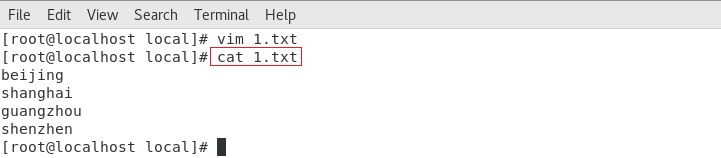


```powershell
用法二：cat 文件1 文件2 > 文件3
示例代码：
#cat 1.txt 2.txt > 3.txt
含义：将1.txt和2.txt文件内容合并后，输出到3.txt
```

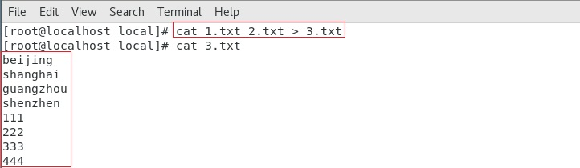


### ②more分屏显示文件

命令：more

作用：分屏查看文件

语法：#more  文件名

==流程：more在读取文件时，默认已经加载文件的全部内容。==

另外：more不能通过上下方向键显示上下内容，退出时会在Shell中留下刚显示的内容


```powershell
用法一：more 文件名
示例代码：
#more /var/log/boot.log
含义：分页显示/var/log/boot.log文件的内容
```

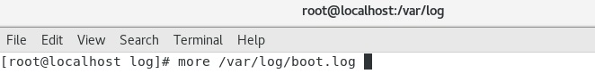

more 命令的执行会打开一个交互界面，下面是一些常用交互命令：

| 回车键 | 向下移动一行。                                       |
| ------ | ---------------------------------------------------- |
| d      | 向下移动半页。                                       |
| 空格键 | 向下移动一页。                                       |
| b      | 向上移动一页，后期引入功能，早期more只能前进不能后退 |
| q      | 退出   more。                                        |

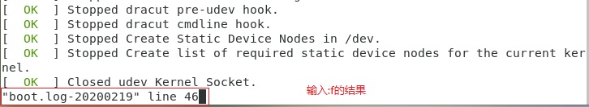


### ③less分屏显示文件

命令：less （less is more，more的增强版）

作用：分屏查看文件

语法：# less  文件名

==流程：不是加载整个文件，而是一点一点进行加载，相对而言，读取大文件时，效率比较高。==

另外：less可以通过上下方向键显示上下内容，退出时不会在Shell中留下刚显示的内容


示例代码：使用less命令查看/var/log/boot.log的文件内容

```powershell
用法一：less 文件名
示例代码：
#less /var/log/boot.log
含义：分页显示/var/log/boot.log文件的内容
```

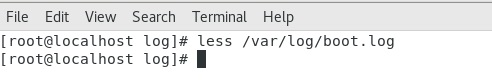

less 命令的执行也会打开一个交互界面，下面是一些常用交互命令（和more类似）：

| 回车键           | 向下移动一行。                     |
| ---------------- | ---------------------------------- |
| d                | 向下移动半页。                     |
| 空格键           | 向下移动一页。                     |
| b                | 向上移动一页。                     |
| 上下方向键       | 向上与向下移动，less命令特有功能键 |
| less -N 文件名称 | 显示行号                           |
| / 字符串         | 搜索指定的字符串。                 |
| q                | 退出less                           |


cat,more,less三者的对比

|            | cat                  | more                   | less                   |
| ---------- | -------------------- | ---------------------- | ---------------------- |
| 作用       | 显示小文件(一屏以内) | 显示大文件（超过一屏） | 显示大文件（超过一屏） |
| 交互命令   | 无                   | 有                     | 有                     |
| 上下键翻行 | 无                   | 无                     | 有                     |


### ④head显示文件开头

命令：head

作用：查看一个文件的前n 行，如果不指定n，则默认显示前10 行。

语法：#head  [参数选项]   文件名

常见参数：-n  表示显示前n行的内容，n等于行数

```powershell
用法一：head 文件名
示例代码：
#head /var/log/boot.log
含义：显示/var/log/boot.log文件的内容，默认为前10行

用法二：head -n 文件名
示例代码：
#head -3 /var/log/boot.log
含义：显示/var/log/boot.log文件的前3行内容
```


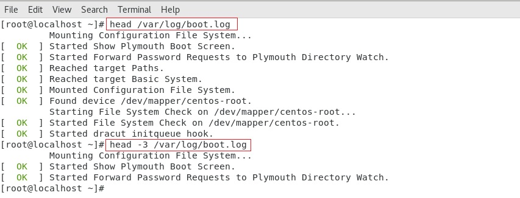

### ⑤tail显示文件结尾（重点）

命令：tail

作用：查看一个文件的最后n 行，如果n 不指定默认显示最后10 行

语法：# tail   -n   文件路径 【n 表示数字】

常见参数：-n  显示最后n行的内容，n等于行数

​                    -f  输出文件变化后新增加的数据

```powershell
用法一：tail 文件名
示例代码：
#tail /var/log/boot.log
含义：显示/var/log/boot.log文件的内容，默认为最后10行

用法二：tail -n 文件名
示例代码：
#tail -5 /var/log/boot.log
含义：显示/var/log/boot.log文件的最后5行内容
```

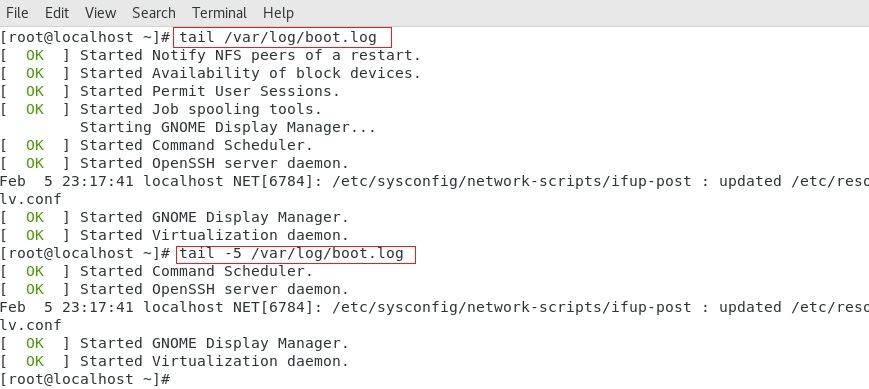


```powershell
用法二：tail -f 文件名
示例代码：
#tail -f /var/log/messages
含义：显示/var/log/messages文件中，执行tail -f 命令后，新增的数据。
注意：作用相当于查看一个文件动态变化的内容，一般用于查看系统的日志的变化
     按下ctrl+c可以退出查看状态
```

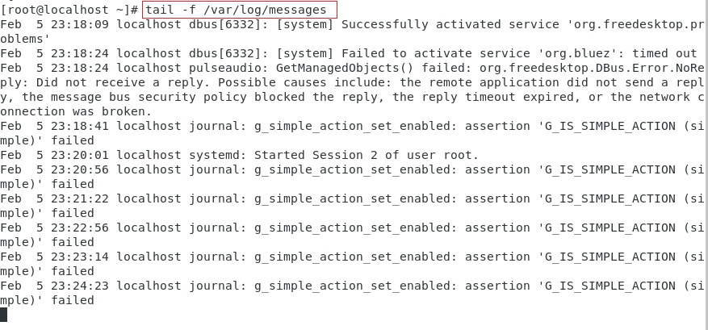

注意：ctrl+c 键，在命令行中c 不再表示copy，而表示cancel（取消），在程序执行过程中，==通常都可以使用ctrl+c来终止程序运行或者退出程序==


## 2、统计文件信息

### ①wc统计文件内容数量

命令：wc，wc = word count

作用：用于统计文件内容信息（包含行数、单词数、字节数）

语法：# wc   [参数选项]   文件名

常见参数：

-l：表示lines，行数（以回车/换行符为标准）

-w：表示words，单词数 依照空格来判断单词数量

-c：表示bytes，   字节数（空格，回车，换行）

```powershell
用法一：wc -lwc 文件名
示例代码：
#wc -lwc /var/log/boot.log
含义：统计/var/log/boot.log文件的行数，单词数，字节数
注意：wc命令选项可以混在一起搭配使用，但选项的顺序不影响输出结果，第一个是行数，第二个是单词数，第三个数字节数。
```


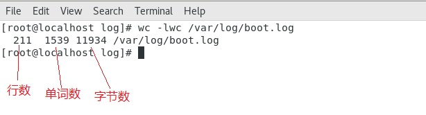


### ②du统计文件大小

命令：du

作用：查看文件或目录(会递归显示子目录)占用磁盘空间大小

语法：# du  [参数选项]  文件名或目录名

常见参数：-s ：summaries，只显示汇总的大小，统计文件夹的大小

​        	   -h：表示以高可读性的形式进行显示，如果不写-h，默认以KB的形式显示文件大小


```powershell
用法一：du 文件名
示例代码：
#du /var/log/boot.log
含义：统计/var/log/boot.log文件的大小

用法二：du -h 文件名
示例代码：
#du -h /var/log/boot.log
含义：统计/var/log/boot.log文件的大小,以高可读性显示
```

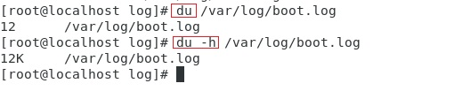


示例代码：统计 /var/log 目录大小

```powershell
用法三：du 目录名
示例代码：
#du /var/log/
含义：统计/var/log/目录的大小，包含目录下每一个单独文件的大小

用法四：du -s 目录名
示例代码：
#du -s /var/log/
含义：统计/var/log/boot.log文件的大小,汇总只显示目录大小

用法五：du -sh 目录名
示例代码：
#du -sh /var/log/
含义：统计/var/log/boot.log文件的大小,汇总只显示目录大小,并采用高可读性
```

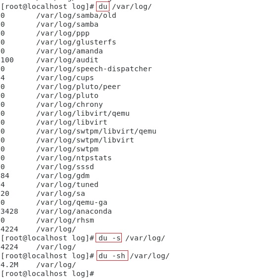


## 3、文本处理

### ①find文件查找（重点）

命令：find

作用：用于查找文档（其选项有55 个之多）

语法：# find  路径范围 选项1 选项1的值  [选项2  选项2 的值…]

常用参数：

-name：按照文档名称进行搜索（支持模糊搜索）

> \* ： 通配符，匹配任意个任意字符

-type：按照文档的类型进行搜索，文档类型的值，f（file)表示文件，d(directory)表示文件夹


```powershell
用法一：find 路径范围 选项1 选项1的值 选项2 选项2的值
示例代码：
#find /var/ -name boot.log -type f
含义：在/var/目录下，查找名称等于boot.log，类型是文件的文档
```

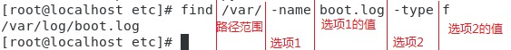


A var表示要查找的目录名字

B var表示，在var目录内查找


```powershell
用法二：find 路径范围 选项1 选项1的值使用通配符 选项2 选项2的值
示例代码：
#find /var/log -name "*.log" -type f
含义：在/var/log目录下，查找所有.log结尾，类型是文件的文档，*.log需要用引号引起来。
```

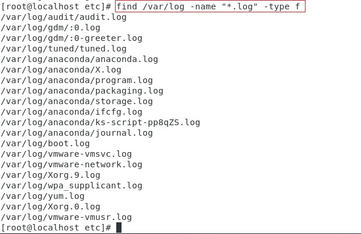


```powershell
用法一：find 路径范围 选项1 选项1的值
示例代码：
#find /var/log -type d
含义：在/var/log目录下，查找所有文件夹
```

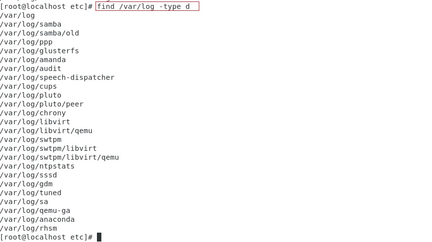


### ②grep搜索文件内容 （重要） 

命令：grep

作用：在文件中直接找到包含指定信息的那些行，并把这些信息显示出来

语法：#grep 要查找的内容 文件名

```powershell
用法一：grep 查找的内容 文件名
示例代码：
#grep network boot.log
含义：在boot.log文件中，查找包含network的行
```

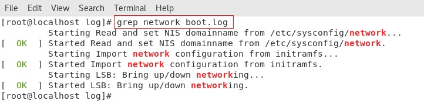


```powershell
用法二：grep 查找的内容 多个文件
示例代码：
#grep network /var/log/*
含义：在/var/log目录下的所有文件中，查找包含network的行
```

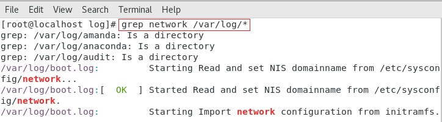


### ③输出重定向

场景：一般命令的输出都会显示在终端中，有些时候需要将一些命令的执行结果想要保存到文件中进行后续的分析/统计，则这时候需要使用到的输出重定向技术。

\>：标准输出重定向 :覆盖输出，会覆盖掉原先的文件内容

\>>：追加重定向 :追加输出，不会覆盖原始文件内容，会在原始内容末尾继续添加

语法：#有输出的命令 重定向符号 文件名

```powershell
用法一：使用 > 进行覆盖输出
示例代码：
#ll > llroot.txt
含义：将ll命令输出的内容，写入到llroot.txt文件中，如果llroot.txt文件中有其他内容，则先清空，在写入
注意：文件路径中的文件可以是不存在的文件，例如llroot.txt可以不存在，执行命令时会自动创建这个文件
```

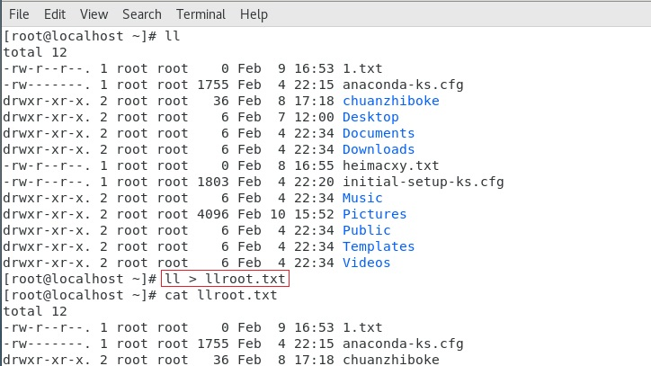


```powershell
用法二：使用 >> 进行追加输出
示例代码：
#ll >> llroot.txt
含义：将ll命令输出的内容，追加写入到llroot.txt文件中
注意：文件路径中的文件可以是不存在的文件，例如llroot.txt可以不存在，执行命令时会自动创建这个文件
```

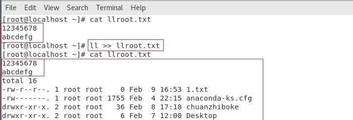

