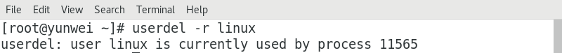
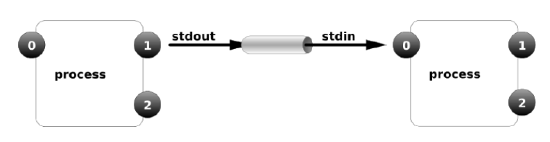
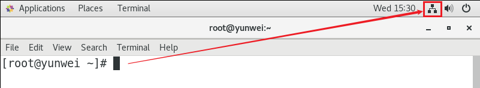
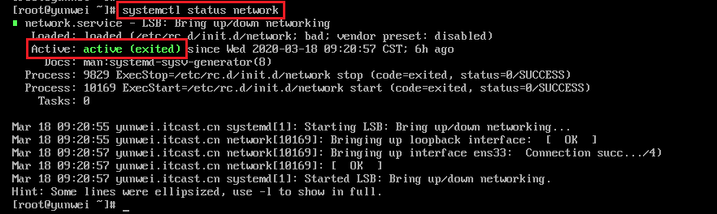
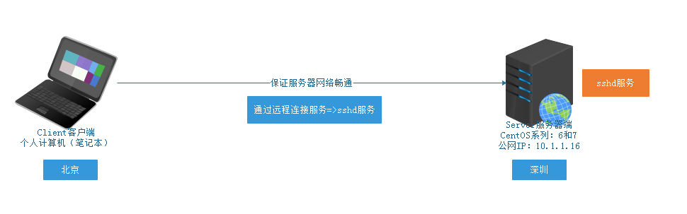
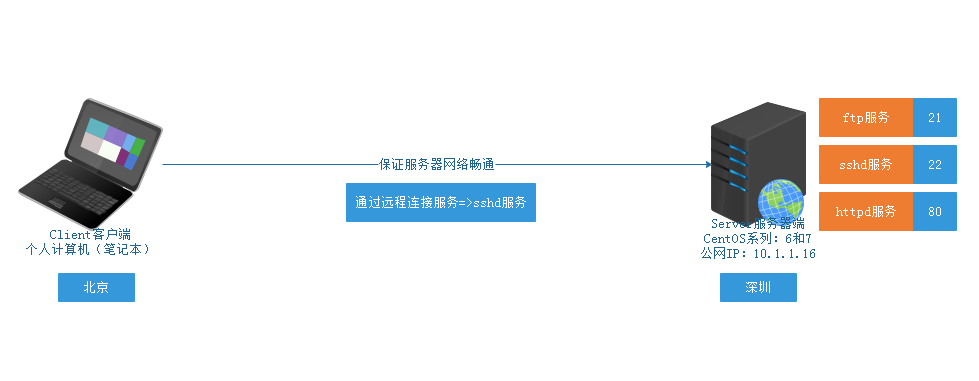
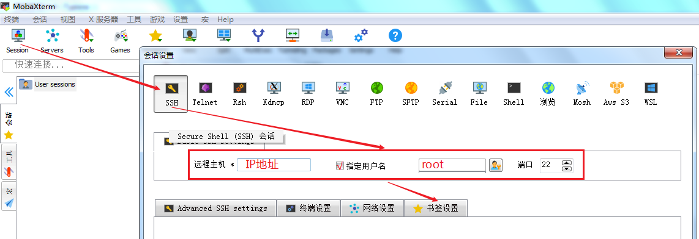
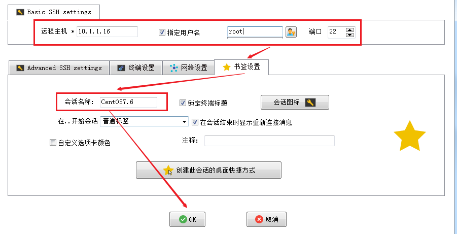
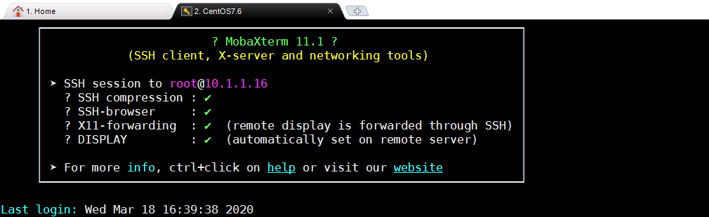
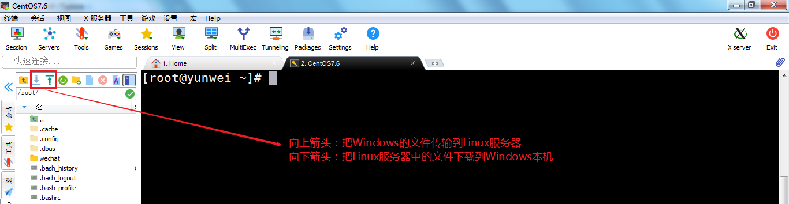

# Linux用户管理与远程管理

# 一、用户管理

## 1、回顾用户组管理

groupadd ：组添加

groupmod：组修改

groupdel：组删除

与用户组相关的文件/etc/group，一共拥有4列

```powershell
itheima:x:1000:
1-组名称
2-组密码
3-组编号
4-组内用户信息（这个组必须是这个用户的附属组或附加组）
```

## 2、回顾用户管理

useradd用户的添加

```powershell
# useradd [选项 选项的值]  用户名称
选项说明：
-g ：指定用户的主组的编号信息
-s ：指定用户可以使用的Shell类型
/bin/bash ：给人用的，给运维工程师
/sbin/nologin ：给软件用的，比如mysql

-G ：指定附属组的ID编号，如果有多个附属组，可以使用逗号隔开 useradd -G 1000,1001 ..
-d ：指定用户的家，/home/itheima，useradd -d /itheima itheima
-u ：指定用户的ID编号，默认是自动生成的
-c ：comment，注释信息，scj:x:uid:gid:宋楚杰的账号
-n ：取消以用户名称命名的组信息
```

id命令

```powershell
# id itheima
```

## 3、与用户相关的用户文件

组：/etc/group文件

用户：/etc/passwd文件，每创建一个用户，其就会在此文件中追加一行

```powershell
# vim /etc/passwd
root:x:0:0:root:/root:/bin/bash
由上图可知，一共拥有7列
第1列：用户名称
第2列：用户的密码，使用一个x占位符，真实密码存储在/etc/shadow(1-用户名，2-加密密码)
第3列：数字，用户的ID编号
第4列：数字，用户的主组ID编号
第5列：代表注释信息，useradd -c "备注信息" 用户名称
第6列：用户的家目录，默认在/home/用户名称
第7列：用户可以使用的Shell类型，useradd -s /bin/bash或/sbin/nologin 用户名称
```

## 4、用户修改操作

用户：user，添加：add，修改：mod，删除：del

基本语法：

```powershell
# usermod [选项 选项的值] 用户名称
选项说明：
-g ：修改用户所属的主组的编号
-l ：login name修改用户的名称
-s ：修改用户可以使用的Shell类型，如/bin/bash => /sbin/nologin

扩展：
-L：锁定用户，锁定后用户无法登陆系统lock
-U：解锁用户unlock

了解：
-G ：修改用户附属组的编号信息
-d ：修改用户的家目录
-c ：修改用户的备注信息
```

案例：修改zhangsan账号信息，更名为zs

```powershell
# usermod -l zs zhangsan
```

案例：修改wangwu账号信息，把用户的主组的编号更新为1000（itheima）

```powershell
# usermod -g 1000 wangwu
```

案例：禁止linuxuser账号登录Linux操作系统

```powershell
# usermod -s /sbin/nologin linuxuser
```

案例：禁止linux用户登录操作（Ctrl + Alt + F2 ~ F6）

> Linux系统除了默认的图形化界面，其实还有5个隐藏的字符界面，按Ctrl + Alt + F1~F6
>
> 有些电脑开启Fn功能键，所以如果Ctrl + Alt + F1~F6不生效，则可以按Ctrl + Alt + Fn + F1~F6

```powershell
# usermod -L linux
```

案例：解锁linux用户

```powershell
# usermod -U linux
```

> 问题：账号已经解锁，但是无法登录
>
> ① 当前账号没有设置密码，因为Linux操作系统不允许没有密码的操作进行登录
>
> ② 当前用户的Shell类型为/sbin/nologin，所以其无法登录

## 5、passwd命令

基本语法：

```powershell
# passwd 用户名称
```

主要功能：为某个用户设置密码（添加或修改），可以给自己也可以给别人设置

案例：修改自己的密码

```powershell
[root@yunwei ~]# passwd
```

案例：为linux账号添加一个密码，密码：123456

```powershell
[root@yunwei ~]# passwd linux
```

> 特别注意：在Linux操作系统中，如果一个账号没有密码，则无法登录操作系统。

## 6、su命令

基本语法：

```powershell
# su [-] root
选项：
- ：横杠（减号），代表切换用户的同时，切换目录到用户的家
```

主要功能：切换用户的账号

> 从超级管理员切换到普通用户，root => itheima，不需要输入itheima的密码
>
> 从普通账号切换到超级管理员，itheima => root，需要输入root的密码
>
> 从普通账号切换到普通账号，itheima => linuxuser，也需要输入linuxuser密码

## 7、wheel组（了解）

Linux系统中，理论上只有在wheel组中的普通用户，才可以通过su命令切换到root账户，默认所有普通用户都能切换到root，只要知道root密码，换句话说，默认此配置不生效

## 8、用户删除操作

基本语法：

```powershell
# userdel [选项] 用户名称
选项说明：
-r ：删除用户的同时，删除用户的家（默认不删除）
```

案例：删除用户但是不删除用户的家目录

```powershell
# userdel zs
```

案例：删除用户的同时删除用户的家目录

```powershell
# userdel -r lisi
```

> 删除账号流程：① 删除账号 ② 确认是否删除用户家 ③ 删除用户主组（没有其他用户）

扩展：当我们想要删除某个账号时，系统提示当前账号正在被某个进程所使用



解决方案：

第一种方案：找到登录的这个用户，然后将其直接注销

第二种方案：

```powershell
# kill [-9] 进程的ID编号
选项说明：-9代表强制结束某个进程
主要功能：用于结束某个进程的继续运行
```

案例：结束11565进程

```powershell
# kill 11565
```

简单粗暴，kill 对应用户的全部进程（尽量斩草除根，结束父进程）

```powershell
# ps -ef |grep linux
ps命令：查看进程
-ef ：查看系统的所有进程
|：管道命令
grep linux：搜索包含了linux关键词的所有进程
```

结束完成后，再次使用userdel删除即可

# 二、管道（重点）

## 1、管道符

=="|"==，竖线

作用：管道是一种通信机制，通常用于进程间的通信。它表现出来的形式将==前面每一个进程的输出（stdout）直接作为下一个进程的输入（stdin）==。



0 ： 标准输入，程序或命令需要外部的某些程序传递相应的参数，才能正常运行

1 ：标准输出，程序或命令正确的执行结果，我们就称之为标准输出

2 ：标准错误，程序或命令错误的执行结果，我们就称之为标准错误

## 2、过滤（筛选）功能

基本语法：

```powershell
# 前一个命令 | 后一个命令
```

案例：获取/根目录下包含关键字"y"的文件信息

```powershell
# ls / | grep y
解析：
| ：管道符号，作用=>把ls /的正确的执行结果作为参数传递给grep命令
ls / ：管道左边的命令
grep y ：管道右边的命令
```

> grep命令的基本语法 => grep  关键字  文件名称

案例：检索系统中的已安装文件，只筛选mariadb软件信息

```powershell
# rpm -qa | grep mariadb
-q ：query，查询
-a ：all，所有
```

案例：在系统的进程中进行查找，查找与itheima相关的进程信息

```powershell
# ps -ef | grep itheima
ps -ef ：查询系统中所有正在运行的进程
```

## 3、特殊功能

通过管道的操作方法来实现less 的等价效果（了解）

例如：源指令是"less xxx.txt"，使用管道的话则可以写成：cat xxx.txt | less

```powershell
# less initial-setup-ks.cfg
更改为管道命令
# cat initial-setup-ks.cfg | less
```

## 4、统计功能（重点）

回顾：wc命令，word count，文件统计功能

```powershell
# wc [选项] 文件名称
选项说明：
-l : 统计总行数
-w : word，总单词数
-c : 统计总字节数
```

案例：统计/根目录下一共有多少个文件

```powershell
# ls / | wc -l
```

案例：用户在计算机中有一个配置文件（/etc/passwd），一般情况下，一个用户会占用一行配置，请你使用现学的管道统计当前计算机中一共有多少个用户个信息（一个用户一行）

```powershell
# cat /etc/passwd | wc -l
```

## 5、xargs命令扩展

问题：为什么需要xargs命令？

答：之所以能用到这个命令，关键是由于很多命令不支持 | 管道来传递参数，而日常工作中又有这个必要，所以就有了 xargs 命令。

> 简单来说，xargs命令就相当于对管道命令进行了一个扩展，让所有命令都支持管道

案例：搜索/etc目录下的所有".conf"结尾的文件信息，然后以详细列表形式显示

```powershell
# find /etc -name "*.conf" | ls -l
```

解决方案，在ls命令之前添加一个xargs命令，这样ls命令就支持管道了，可以用于接收前一个命令的执行结果

```powershell
# find /etc -name "*.conf" | xargs ls -l
```

# 三、Linux网络管理

## 1、获取计算机的网络信息

基本语法：

```powershell
# ifconfig
```

> Windows => ipconfig    Linux => ifconfig

第一步：连接网络



第二步：使用ifconfig命令，获取计算机的网络信息

```powershell
# ifconfig
ens33: flags=4163<UP,BROADCAST,RUNNING,MULTICAST>  mtu 1500
        inet 10.1.1.16  netmask 255.255.255.0  broadcast 10.1.1.255
        inet6 fe80::e472:7b78:c871:8e12  prefixlen 64  scopeid 0x20<link>
        ether 00:0c:29:48:bf:f9  txqueuelen 1000  (Ethernet)
        RX packets 254  bytes 54837 (53.5 KiB)
        RX errors 0  dropped 0  overruns 0  frame 0
        TX packets 287  bytes 42006 (41.0 KiB)
        TX errors 0  dropped 0 overruns 0  carrier 0  collisions 0
        
解析：inet 10.1.1.16  netmask 255.255.255.0  broadcast 10.1.1.255
inet 10.1.1.16 ：代表ens33网卡的IP地址，将来远程连接就是用这个IP
netmask ：子网掩码，一般为255.255.255.0
broadcast ：广播地址，10.1.1.255
```

> CentOS6 => eth0 ， CentOS7 => ens33

ens33 ：是默认的网卡，我们获取的IP也要从这个网卡中获取

lo（loop，循环）：表示回环网卡，只有一个固定的IP地址，127.0.0.1代表本机

virbr0：虚拟网络接口，因为咱们使用vmware虚拟机安装Centos，所以其会产生virbr0虚拟网络接口

## 2、与网卡相关的配置文件

Linux系统中，一切皆文件。所以保存网络信息的也是通过一个文件来完成的。

```powershell
# vim /etc/sysconfig/network-scripts/ifcfg-ens33
TYPE="Ethernet"
BOOTPROTO="dhcp"
NAME="ens33"
UUID="6c809893-d12c-46af-9987-4c05b2773c91"
DEVICE="ens33"
ONBOOT="yes"

参数解析：
TYPE ：网络类型，Ethernet以太网
BOOTPROTO：IP的获取方式，dhcp代表自动获取，static/none代表手工设置
NAME ：网卡的名称（名字），ens33
UUID ：代表网卡的UUID编号（必须是唯一的）
DEVICE ：设备名称
ONBOOT ：代表网卡是否随计算机开启启动，yes随计算机开机启动，no代表不启动
```

## 3、查询计算机的网络状态

基本语法：

```powershell
# systemctl  status  network

systemctl = system + control = 系统控制
```

主要功能：查询计算机网络的状态，网络是否正常连接。



Active ： active（正常）或  inactive（dead，网络状态不正常没有连接）

## 4、systemctl启动/重启/停止网络

```powershell
# systemctl start network
# systemctl stop network
# systemctl restart network

选项解析：
start ：启动
stop ：停止
restart ：重启
```

# 四、Linux远程连接与文件传输

## 1、为什么需要远程连接



## 2、SSH协议

  简单说，SSH是一种网络协议，用于计算机之间的加密登录。

## 3、sshd服务

当我们在计算机中安装了sshd软件，启动后，就会在进程中产生一个sshd进程，其遵循计算机的SSH协议。默认情况下，sshd服务随系统自动安装的。

```powershell
# systemctl  status  sshd
```

## 4、sshd服务的端口号

SSH协议，其规则了远程连接与传输的端口号，所以sshd服务启动后，就会占用计算机的22号端口。

> 端口号能解决什么问题？答：能让我们的计算机区分出不同的服务



## 5、使用MX软件连接Linux服务器

### Putty

官网：[www.putty.org](https://links.jianshu.com/go?to=http%3A%2F%2Fwww.putty.org)

PuTTY为一开放源代码软件，主要由Simon Tatham维护，使用MIT licence授权。


### SecureCRT

官网：[www.vandyke.com](https://links.jianshu.com/go?to=http%3A%2F%2Fwww.vandyke.com)
 SecureCRT是一款支持SSH(SSH1和SSH2)的终端仿真程序，简单地说是Windows下登录UNIX或Linux服务器主机的软件。（颜色方案不是特别好看）


### XShell

官网：[www.netsarang.com](https://links.jianshu.com/go?to=http%3A%2F%2Fwww.netsarang.com)

Xshell是一个强大的安全终端模拟软件，它支持SSH1, SSH2, 以及Microsoft Windows 平台的TELNET 协议。Xshell 通过互联网到远程主机的安全连接以及它创新性的设计和特色帮助用户在复杂的网络环境中享受他们的工作。

缺点：收费


### MobaXterm

官网：<https://mobaxterm.mobatek.net/>


① 获取Linux的的IP地址

```powershell
# ifconfig
10.1.1.16
```

② 打开MX软件，单击Session，创建一个SSH远程连接



③ 设置书签（给这台服务器起个名字）



 ④ 输入CentOS7.6的root管理员密码

管理员：root

密    码：123456



## 6、使用MX实现文件传输




