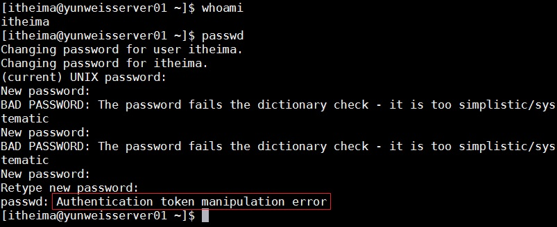
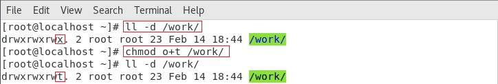

# Linux的权限管理操作

# 学习目标

1、知道为什么要设置权限

2、linux中的权限类别和身份类别

3、掌握文件和文件夹权限的设置方法（字母和数字）

4、掌握文件和文件夹的属主属组设置方法

5、了解设置位与粘滞位

6、知道为什么要使用ACL

7、掌握ACL的使用方法


# 一、权限概述

## 1、什么是权限

​        在多用户计算机系统的管理中，权限是指某个特定的用户具有特定的系统资源使用权利。

在Linux 中分别有读、写、执行权限：


|       | 权限针对文件                                             | 权限针对目录                                                 |
| ----- | -------------------------------------------------------- | ------------------------------------------------------------ |
| 读r   | 表示可以查看文件内容；cat                                | 表示可以(ls)查看目录中存在的文件名称                         |
| 写w   | 表示可以更改文件的内容；vim 修改，保存退出               | 表示是否可以删除目录中的子文件或者新建子目录(rm/touch/mkdir) |
| 执行x | 表示是否可以开启文件当中记录的程序,一般指二进制文件(.sh) | 表示是否可以进入目录中(cd)                                   |


注：一般给予目录读权限时，也将会给其执行权限，属于“套餐”组合

假设目录叫做 boxuegu

cd boxuegu

ls

ls /boxuegu


A 给boxuegu文件夹的权限

B root


## 2、为什么要设置权限

1）服务器中的数据价值

2）员工的工作职责和分工不同

3）应对自外部的攻击

4）内部管理的需要


## 3、Linux中的权限类别

Linux 系统一般将文件权限分为3 类：

read（读）

write（写）

execute（执行）

**谁**对文件有读，写，执行的权限呢？


## 4、Linux中文件所有者

### 1）所有者分类（谁）

对于文件的所有者，又分为3类：
user(属主）
group（属组）
other（其他用户）


**user(属主）**：文件的创建者或拥有者，换句话说，某==个账户==对这个文件有的权限。

A 一个人

B 多个人


**group（属组）**：文件所属的用户组，换句话或，某个用户==组==对这个文件有的权限。

A 一个人

B 多个人


**other（其他用户）**：除了上面提到的属主和属组之外的所有用户，对这个文件有的权限

A 一个人

B 多个人


**举例：**
​        爱情公寓拆迁，拆迁款按照政策，分配如下：一半给张伟，另一半由爱情公寓3601和3602室的其余的伙伴平分。如果把拆迁款看做一个文件，那么这个文件的权限是：

属主：张伟
属组：3601和3602的其他伙伴，他们是一个组
其他用户：没有


### 2）所有者的表示方法

#### ① u(the user who owns it)（属主权限）

用==u==表示，文件所有者，默认为文档的创建者

#### ② g(other users in the file's group)（属组权限）

用==g==表示，在文件所属组（默认是创建文件的用户的主组）里的用户

#### ③ o(other user not in the file's group)（其他权限）

用==o==表示，既不是文件的创建者，也不在文件属组里的用户，称为其他人


注意：某些资料上会提到linux ugo权限，所谓ugo，就是User, Group,Other三个单词的首字母。就指属主，主组，其他三种权限。


ugo等于u+g+o

a （all)等于u+g+o

我们后面设置文件权限的时候，会用到


#### ④ root用户（超级管理员）

​        在Linux 中，还有一个神一样的用户，这就是root 用户，因为在所有用户中它拥有最大的权限 ，可以管理着普通用户。因此以后在设置文档的权限的时候不必考虑root 用户。 


# 二、普通权限管理

## 1、ls查看文件权限

​        要设置权限，就需要知道文件的一些基本属性和权限的分配规则。在Linux 中，ls 命令常用来查看文档的属性，用于显示文件的文件名和相关属性。

​        ls命令我们之前学过，用于查看文件信息，这里我们使用之前提到过的一个用法，ll


```powershell
用法一：ll
示例代码：
#ll
含义：查看当前文件夹下的所有目录和文件的详细信息
```


## 2、文件权限详解

Linux 中存在三类身份：

属主(owner拥有者)
属组(group用户组)
其他用户（others）

各自有不同的权限，对于一个文档来说，其权限具体分配如下：


linux一共有7种文件类型,分别如下:
-：普通文件
d：目录文件
l： 软链接（类似Windows的快捷方式）

(下面四种是特殊文件)
b：块设备文件（例如硬盘、光驱等）
p：管道文件
c：字符设备文件（例如猫等串口设备）
s：套接口文件/数据接口文件（例如启动一个MySql服务器时会产生一个mysql.sock文件）


文件权限对应关系（==对应数字后面有用==）

| 权限 | 对应数字 | 意义   |
| ---- | -------- | :----- |
| r    | 4        | 可读   |
| w    | 2        | 可写   |
| x    | 1        | 可执行 |

```powershell

前10位字符表示含义：
第1位：表示文件类型
第2-4位：表示文件所有者的权限情况，第2位r表示读权限，第3位w表示写权限，第4位x表示执行权限。
第5-7位：表示与文件所有者同组的用户的权限情况，第5位r表示读权限，第6位-表示不可写，第7位x表示执行权限。
第8-10位：表示除了组外的其他用户权限情况，第8位r表示读权限，第9位-表示不可写，第10位x表示执行权限。
```

前10位字符表示含义：
第1位：表示文件类型
第2-4位：表示文件**属主**（所有者）的权限情况
第5-7位：表示与文件**属组**（用户组）的用户的权限情况
第8-10位：表示**其他**（除了属主和属组之外的其他用户）权限情况


## 3、设置文件/文件夹权限

命令：chmod

语法：# chmod   [选项]    权限模式   文档

作用：增加或者减少当前文件所有者的权限（注意，==不能改变所有者==，==只能改变==现有所有者的==权限==）

常用选项：-R：递归设置权限 （当文档类型为文件夹的时候）

权限模式：就是该文档需要设置的权限信息

文档：可以是文件，也可以是文件夹，可以是相对路径也可以是绝对路径。

注意点：如果想要给文档设置权限，操作者要么是root 用户，要么就是文档的所有者。


### ① 字母形式（对应前面提到的u g o，r w x的表示方法）

使用root用户登录

```powershell
用法一：chmod -R 要增加的权限 文件名
示例代码：
#chmod -R u+x quanxian.txt
含义：对于quanxian.txt文件，给 属主 增加 执行 权限
```


```powershell
用法二：chmod -R 多个要增加的权限 文件名
示例代码：
#chmod -R g+x,o+x quanxian.txt
含义：对于quanxian.txt文件，给 属组 增加 执行 权限，给 其他 增加 执行权限。
注意：同时改变多个对象的权限，中间使用“逗号“分割。
```


```powershell
用法三：chmod -R 要减少的权限 文件名
示例代码：
#chmod -R o-x quanxian.txt
含义：对于quanxian.txt文件，给 其他 减少 执行权限。
```


```powershell
用法四：chmod -R 要赋予的权限 文件名
示例代码：
#chmod -R u=rwx,g=rwx,o=rwx quanxian.txt
含义：对于quanxian.txt文件，给属主，属组，其他，都 赋予 读，写，执行权限
```


```powershell
用法五：chmod -R 要赋予的权限 文件夹
示例代码：
#chmod -R a=rwx quanxianfolder
含义：对于quanxianfolder文件夹，给所有用户（属主，属组，其他），都 赋予 读，写，执行权限
```


如果只想给属主和属组赋予读写权限，要怎么写？
答：u+rw,g+rw

如果同时==去掉==**属组**和**其他**的==写==权限，要怎么写？
答：g-w,o-w


总结：

```powershell
权限设置要考虑的因素：
首先：
    给谁设置？
    u    可以给属主设置权限
    g    可以给属组设置权限
    o    可以给其他用户设置权限
    ugo  给所有用户设置权限(主+组+其他)
    a    给所有用户设置权限

第二：
    怎么设置？
    +    添加权限
    -    减少权限
    =    赋予权限

第三：
    增加减少或者赋予什么权限？
    r    读
    w    写
    x    执行
```


相关参数总结：

| 字母      | 选项    | 作用              |
| --------- | ------- | ----------------- |
| u（谁）   | user    | 属主              |
| g（谁）   | group   | 属组              |
| o（谁）   | other   | 其他用户          |
| a（谁）   | all     | 所有人（包含ugo） |
| +（作用） | 加      | 增加作用          |
| -（作用） | 减      | 移除作用          |
| =（作用） | 等于    | 赋值作用          |
| r（权限） | read    | 可读权限          |
| w（权限） | write   | 可写权限          |
| x（权限） | execute | 可执行权限        |
| -（权限） | -       | 没有任何权限      |

注：

1）如果同时设置多个身份的权限时候，每个身份之间需要通过英文逗号分开。

例如：

```powershell
#chmod -R u=rwx,g=rwx,o=rwx quanxian.txt
```


2）在权限设置中，如果有两部分权限一样则可以合在一起写

```powershell
例如：
# chmod u=rwx,g=rwx
等价于：
# chmod ug=rwx
```

作业：如果想给属主，属组，其他同时设置权限读写执行，有几种写法，分别是？


### ② 数字形式

​        经常会在技术网站上看到类似于# chmod 777 a.txt 这样的命令，这种形式称之为==数字形式权限==。

文件**权限与数字**的对应关系，我们会发现**没有7**这个数字

| 权限 | 对应数字 | 意义   |
| ---- | -------- | :----- |
| r    | 4        | 可读   |
| w    | 2        | 可写   |
| x    | 1        | 可执行 |

权限与数字对应详解


| 数字 | 权限    | 作用                     |
| ---- | ------- | ------------------------ |
| 0    | -       | 不能读，不能写，不能执行 |
| 1    | execute | 不能读，不能写，可执行   |
| 2    | write   | 不能读，可写，不能执行   |
| 3    | 2+1     | 不能读，可写，可执行     |
| 4    | read    | 可读，不能写，不能执行   |
| 5    | 4+1     | 可读，不能写，可执行     |
| 6    | 4+2     | 可读，可写，不能执行     |
| 7    | 4+2+1   | 可读，可写，可执行       |

**技巧：不要背上面的表格，只要记住R，W，X对应4,2,1，之后做10以内加法**

```powershell
用法六：chmod -R 要赋予的权限（数字形式） 文件名
示例代码：
#chmod -R 765 quanxian.txt
含义：对于quanxian.txt文件，给属主所有权限，属组读写权限，其他读和执行权限
注意：
全部权限：7 = r+w+x = 4 + 2 + 1
读写权限：6 = r+w = 4 + 2
读和执行：5 = r+x = 4 + 1
综上所述，u=7，g=6，o=5
```


问题：用超级管理员设置文档的权限命令是# chmod  -R  731 shop，请问这个命令有没有什么不合理的地方？

分析：

```powershell
所有者权限：7 = 4 + 2 + 1 = 读 + 写 + 执行
同组用户权限：3 = 2 + 1 = 写 + 执行
其他用户权限：1 = 执行

问题在权限731中的3权限，3表示写+执行权限，但是写又必须需要能打开之后才可以写，因此必须需要具备可读权限，因此此权限设置不合理。

注：实际工作中，各位小伙伴在设置权限时一定不要设置这种"奇葩权限"，一般情况下，单独出现2、3的权限数字一般都是有问题的权限。
```

==一般==linux系统中，==不允许出现777==的权限。

755


### ③ 练习题

1）使用root 用户设置文件夹/root/shop 的权限为：属主全部权限，属组拥有读和执行权限，其他用户没有权限，请使用数字权限的形式设置

```powershell
rwx=7,rx=4+1=5,0
# chmod -R 750 /root/shop
```


2）请置文件/root/readme.txt 的权限，权限要求为：

​        属主拥有**全部**权限，属组要求可以**读写**，其他用户**只读**，要求使用数字形式；

```powershell
rwx=7,rw=4+2=6,r=4
# chmod 764 /root/readme.txt
```


3）请设置/root/email.doc权限，权限要求只有属主可以读写，除此之外任何人没有权限；

```powershell
rw=6,0,0
# chmod 600 /root/email.doc
```


## 4、特别说明

在Linux 中，如果要删除一个文件，不是看文件有没有对应的权限，而是看文件所在的==目录是否有写权限==，如果有才可以删除（同时必须具备执行权限）。

|       | 权限针对文件                                             | 权限针对目录                                                 |
| ----- | -------------------------------------------------------- | ------------------------------------------------------------ |
| 读r   | 表示可以查看文件内容                                     | 表示可以(ls)查看目录中存在的文件名称                         |
| 写w   | 表示可以更改文件的内容                                   | 表示是否可以删除目录中的子文件或者新建子目录(rm/touch/mkdir) |
| 执行x | 表示是否可以开启文件当中记录的程序,一般指二进制文件(.sh) | 表示是否可以进入目录中(cd)                                   |


# 三、属主（zhu）与属组（zu）设置

## 1、什么是属主与属组？

属主：所属的用户，文档所有者，这是一个账户，这是一个人

属组：所属的用户组，这是一个组


基本语法：`# ls -l`查看文档属主与属组


这两项信息在文档创建的时候会使用创建者的信息（用户名、用户所属的主组名称）。


问题：为什么itheima.txt 的属主和属组默认都是itheima


## 2、为什么要修改属主与属组？

举例：

​        

​        一个财务表格，以前由胡一菲进行更新，她有读写权限，现在胡一菲去阿拉善沙漠找曾老师了，改权限没用，需要把属主改成诸葛大力，由诸葛大力更新。


## 3、chown修改文件的属主

基本语法：`# chown [-R] 新文档拥有者名称 文档路径`

==作用：更改文档的所属用户（change owner）==

选项：-R 代表递归修改文件的属主

示例代码1：将readme.txt文档属主更改为itheima

```powershell
#touch readme.txt
#ll readme.txt

#chown itheima readme.txt 
将readme.txt文件的属主设置为itheima

#ll readme.txt 
```


示例代码2：将shop文件夹的拥有者更改为itheima

```powershell
#mkdir shop
#ll
#chown itheima shop
将shop文件夹的属主设置为itheima

#ll
```


## 3、chgrp修改文件的属组

基本语法：`# chgrp  [-R]  新文档组名称  文档的路径`

==作用：更改文档的所属用户组（change group）==

示例代码1：将readme.txt文档所属组修改为itcast


错误信息：invalid user: ‘itheima’

不可用的账户"itheima"

原因：检查是否有这个账户，如果没有，需要新建


示例代码2：将shop文档所属组修改为itcast


## 4、chown同时修改属主与属组(重点)

问题：如何通过一个命令实现既可以更改所属的用户，也可以修改所属的用户组呢？

答：使用 chown 命令

基本语法：`语法：# chown [-R] username:groupname 文档路径`

示例代码：将readme.txt文件的拥有者与所属组都更改为root

```powershell
#ll readme.txt 
#chown root:root readme.txt 
将readme.txt文件的属主和属组同时设置为root

#ll readme.txt 
```


```powershell
特别注意：
一般来说，这个指令(chown)只有是由系统管理者(root)所使用，普通用户没有权限可以改变别人的档案拥有者，也没有权限可以将自己的档案拥有者改设为别人。只有系统管理者(root)才有这样的权限。
```


# 四、特殊权限（扩展）

## 1、设置位S（SetUid）

作用：为了让一般使用者临时具有该文件所属主/组的执行权限。

例如：/usr/bin/passwd在执行它的时候需要去修改/etc/passwd和/etc/shadow等文件，这些文件除了root外，其他用户都没有写权限，但是又为了能让普通用户修改自己的密码，该怎么办呢？

答：可以临时让他们具有root的权限，而这个s权限就是用来完成这个特殊任务的。s权限只能应用在二进制的可执行文件上。


示例代码：不想让普通用户修改自己的密码


> 注：which命令可以用于查看二进制可执行文件所在位置

去除s权限，基本语法：

```powershell
#which passwd
#ll /usr/bin/passwd 

#chmod u-s /usr/bin/passwd 
或者
#chmod 0755 /usr/bin/passwd
去除passwd程序的s权限


#ll /usr/bin/passwd 
```


测试普通用户：



注：0755最前面的0表示不使用任何特殊权限，如果想使用数字设置特殊权限，可以使用4表示设置S位


## 2、沾滞位T (sticky bit)

命令：chmod

语法：# chmod   [选项]    文件夹

作用：只允许文件的创建者和root用户删除文件

常用选项：o+t 添加粘滞位

​                    o-t 去掉粘滞位

​      

```powershell
用法：chmod o+t 目录名
示例代码：
#chmod o+t 
含义：给目录增加粘滞位权限。
```


举例：

​        公司多个部门公用一个文件夹work,为了让所有人都能访问，work文件夹赋予了777权限，用户root新建了一个文件root.txt，发现被别人删除了。我们希望root建立的文件，只有root自己可以删。

​        

​        步骤1：root用户下操作

​        root用户新建文件夹/work，并且新建两个文件root.txt和root1.txt，赋予/work文件夹和下面的文件777权限

```powershell
#mkdir /work
#cd /work
#touch root.txt
#touch root1.txt
#chmod -R 777 /work
#ll -d /work
```


​       步骤2： wangwu用户下操作

​        在没有设置粘滞位的时候，wangwu可以删除root创建的文件。


```powershell
cd /work
ll -d /work
ll
rm -rf root.txt
ll
```


​        步骤3：root用户下操作:

​        给/work文件夹添加粘滞位

```powershell
#ll -d /work/
#chmod o+t /work
#ll -d /work/
```




​        步骤4：wangwu用户下操作
​        发现添加粘滞位后，无法删除root2.txt文件

```powershell
#ll -d /work/
#chmod o+t /work
#ll -d /work/
```


​        步骤5：root用户下操作

​        去掉/work文件夹的取消粘滞位

```powershell
#ll -d /work/
#chmod o-t /work
#ll -d /work/
```


​        步骤6：wangwu用户下操作
​        wangwu用户下，发现又可以删除了

```powershell
#cd /work/
#rm -rf root1.txt
#ll
```


# 五、ACL访问控制

问题：我们学过的所有者身份包含哪些？

答案:ugo,属主，属组，其他。


问题：我们学过的文件权限包含哪些？

答案：rwx，读写执行，特殊s,t


​        ACL，是 Access Control List（访问控制列表）的缩写，在 Linux 系统中， ACL 可实现对单一用户设定访问文件的权限。


## 1、基本命令

getfacl命令：查看文件的ACL策略及权限

setfacl命令： 给文件针对某个用户或者某个组来增加（设置）ACL策略

## 2、getfacl命令


## 3、setfacl命令

-m ： 修改acl策略

-x  ：去掉某个用户或者某个组的权限

-b  ：删除所有的acl策略

-R  ：递归,通常用在文件夹

mask：mask定义除other和所有人(拥有者)外的最大权限

```powershell
setfacl -m u:用户名:rwx /usr/local/shichangbu  给单个用户单独加权限

setfacl -m g:用户组名:rwx /usr/local/shichangbu   给单个组单独加权限

setfacl -x u:用户 /usr/local/shichangbu  去掉某个用户的权限
setfacl -x g:组名 /usr/local/shichangbu    去掉某个组的acl策略

setfacl -b -R /usr/local/shichangbu  删除所有的acl策略,递归子文件

例如：
setfacl -m u:user01:rw   file1 针对于单个用户给可读可写权限
setfacl -m g:sysadmin:rw file1 针对于单个组给可读可写权限
```

示例代码1：给newuser01用户单独在市场部文件夹上增加rx权限

```powershell
#mkidr /shichangbu
#cd /shichangbu
#touch file{1..5}.txt
#chown -R root:itheima shichangbu/
递归设置shichangbu文件夹的属主是root，属组是itheima
#getfacl shichangbu/

#useradd newuser01
#passwd newuser01 

#setfacl -m u:newuser01:rx -R /usr/local/shichangbu/
单独设置newuser01对于shichangbu文件夹的rx权限，并且递归包含所有子文件

#getfacl /usr/local/shichangbu
查看/usr/local/shichangbu文件夹的ACL权限
```


验证newuser01用户对于file1文件只有读权限


示例代码2：给newusergrp组在市场部文件夹上增加rx权限，递归所有子文件

```powershell
#groupadd newusergrp
#setfacl -m g:newusergrp:rx -R /usr/local/shichangbu/
单独设置newusergrp组对于shichangbu文件夹的rx权限，并且递归包含所有子文件

#getfacl /usr/local/shichangbu/

```


setfacl命令解释


示例代码3：删除所有acl策略


# 六、umask（扩展）

## 1、什么是umask

umask表示创建文件时的默认权限（即创建文件时不需要设置而天生的权限）

例如：

 root用户下，touch a ，文件a的默认权限是644

 普通用户下，touch b ，文件b的默认权限是664 

644和664我们并没有设置，其中的关键因素就是**umask**


最大默认权限：

文件666

文件夹777

​         


## 2、umask值

可以使用命令umask来查看umask的值：

基本语法：# umask


注：0022中第一位0代表特殊权限位，可以不设置。

umask的默认值，在root和普通用户下是不一样的，分别是022和002


分析：


结合上述的举例得知：

```powershell
默认权限=最高权限-umask（ 644=666-022 // 664=666-002 ）
```


但是：

当umask为011，创建文件的默认权限应该是655，但是实际运行的时候默认权限是 666

`666 -> rw-rw-rw-`

`011 -> -----x--x`

相减得：

`666 -> -rw-rw-rw-`

注：这个特殊情况仅出现在文件，因为文件[二进制文件除外]没有x执行权限)，  所以，查看文件的umask时我们要特别注意是否有奇数位（x表示1）


## 3、修改umask值

 umask + 数值修改当前用户的umask 如：`# umask 044`

不过这样设置的umask会在用户重新登录的时候恢复原来的值，我们可以把修改的umask保存在`~/.bashrc`

操作步骤：

```powershell
#vim ~/.bashrc
① 在文件末尾添加umask 044
② 保存退出 
③ 重新登录用户则保存成功
```

示例代码：


