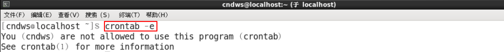

---

typora-copy-images-to: ./media
---

自有服务，即不需要用户独立去安装的软件的服务，而是当系统安装好之后就可以直接使用的服务（内置）

# 学习目标

1、了解systemctl命令用途

2、掌握使用systemctl开启，关闭，重启服务

3、了解常见自有服务ntpd,firewalld,crond的作用

4、掌握ntpdate时间同步原理与实现

5、掌握防火墙的相关操作（添加和删除简单规则，开启，关闭防火墙）

6、了解源码包和二进制包的区别

7、掌握rpm包的卸载、安装以及更新操作

8、了解计划任务的作用

9、掌握计划任务的编辑


# 一、自有服务概述

​        服务是一些特定的进程，自有服务就是系统开机后就自动运行的一些进程，一旦客户发出请求，这些进程就自动为他们提供服务，windows系统中，把这些自动运行的进程，称为"服务"
​        举例：当我们使用SSH客户端软件连接linux的时候，我们的服务器为什么会对连接做出响应？是因为SSH服务开机就自动运行了。

​        所谓自有服务，简单来说，可以理解为Linux系统开机自动运行的服务（程序）。

​        我们如何管理这些自有服务呢？


# 二、systemctl管理服务命令

​        在Centos7之前，通过service 和 chkconfig两个命令来管理服务

service: 负责启动，停止服务，显示服务状态

chkconfig: 指定服务是否开机启动

​        从Centos7开始，统一使用systemctl来管理服务， systemctl同时具有service和chkconfig命令的功能。


## 1、显示服务

命令：systemctl

作用：管理服务

语法：#systemctl   [选项]

选项：list-units --type service --all：列出所有服务（包含启动的和没启动的）

​           list-units --type service：列出所有启动的服务


```powershell
用法一：systemctl list-units --type service --all 不加具体服务名
示例代码：
#systemctl list-units --type service --all
含义：列出所有服务，包括已运行的和没有运行的
空格可以翻页，q退出
```


```powershell
用法二：systemctl list-units --type service 不加具体服务名
示例代码：
#systemctl list-units --type service
含义：列出已运行的服务
空格可以翻页，q退出
```


## 2、查看启动和停止服务

命令：systemctl

作用：管理服务

语法：#systemctl   [选项]  服务名

选项： status：检查指定服务的运行状况

​            start：启动指定服务

​	    stop：停止指定服务

​	    restart：重启指定服务

​	    reload：重新加载指定服务的配置文件（并非所有服务都支持reload，通常使用restart)


```powershell
用法三：systemctl 选项 服务名
示例代码：
#systemctl status crond
含义：查看crond服务的状态
```


Active:active(running) 表示当前crond服务是运行状态。


```powershell
用法四：systemctl 选项 服务名
示例代码：
#systemctl stop crond
含义：停止crond服务
```


Inactive,表示crond服务当前是停止状态


```powershell
用法五：systemctl 选项 服务名
示例代码：
#systemctl start crond
含义：启动crond服务
```


```powershell
用法六：systemctl 选项 服务名
示例代码：
#systemctl restart crond
含义：重启crond服务

#systemctl reload crond
含义：重新加载crond服务配置文件
```


## 3、服务持久化

​        所谓服务持久化，就是服务在开机的时候，是否自动启动。

命令：systemctl

作用：管理服务

语法：#systemctl   [选项]  服务名

选项： enable：指定服务开机自动启动

​            disable：取消服务开机自动启动


```powershell
用法七：systemctl 选项 服务名
示例代码：
#systemctl disable crond
含义：取消crond服务开机启动
```


```powershell
用法八：systemctl 选项 服务名
示例代码：
#systemctl disable crond
含义：指定crond服务开机启动
```


systemctl参数总结

| 参数                              | 含义                                                         |
| --------------------------------- | ------------------------------------------------------------ |
| list-units --type service   --all | 列出所有服务                                                 |
| list-units --type service         | 列出所有启动的服务                                           |
| start                             | 启动指定服务                                                 |
| stop                              | 停止指定服务                                                 |
| status                            | 检查指定服务的运行状况                                       |
| restart                           | 重启指定服务                                                 |
| reload                            | 重新加载指定服务的配置文件（并非所有服务都支持reload，通常使用restart) |
| enable                            | 指定服务开机自动启动                                         |
| disable                           | 取消服务开机自动启动                                         |


# 三、常用自有服务（ntp,firewalld,crond)


| 服务名    | 含义                           |
| --------- | ------------------------------ |
| ntpd      | 用于同步计算机的系统时间的服务 |
| firewalld | 防火墙服务                     |
| crond     | 计划任务服务                   |


## 1、ntp时间同步服务

​        NTP是网络时间协议(Network Time Protocol)，它是用来同步网络中各个计算机的时间的协议。

 工作场景：

​        公司开发了一个电商网站，由于访问量很大，网站后端由100台服务器组成集群。50台负责接收订单，50台负责安排发货，接收订单的服务器需要记录用户下订单的具体时间，把数据传给负责发货的服务器，由于100台服务器时间各不相同，记录的时间经常不一致，甚至会出现下单时间是明天，发货时间是昨天的情况。

### 1）NTP同步服务器原理

​        标准时间是哪里来的？

​        现在的标准时间是由原子钟报时的国际标准时间UTC（Universal Time Coordinated，世界协调时)，所以NTP获得UTC的时间来源可以是原子钟、天文台、卫星，也可以从Internet上获取。

​        在NTP中，定义了时间按照服务器的等级传播，**Stratum层的总数限制在15以内**

​        工作中，==通常我们会直接使用各个组织提供的，现成的NTP服务器==


### 2）到哪里去找NTP服务器

​        NTP授时网站：http://www.ntp.org.cn/pool.php


### 3）时间同步操作

同步服务器时间方式有2 个：一次性同步手动同步、通过服务自动同步。

手动同步

```powershell
用法一：ntpdate 时间服务器IP
示例代码：
#ntpdate 120.25.108.11
含义：从服务器120.25.108.11同步标准网络时间到服务器（120.25.108.11服务器由阿里云提供，可以从http://www.ntp.org.cn/pool.php网站获取）
注意：从网络同步时间，要确保自己的服务器可以访问互联网
```


错误信息：no servers can be used

含义：服务器不可用，这里的服务器是指网络上的时间服务器，不可用，不代表是对方服务器有问题，也有可能是你自己的服务器网络不通，无法连接到网络上的时间服务器。


自动同步

```powershell
用法二：启动ntpd服务，并配置为开机启动
示例代码：
#systemctl start ntpd
#systemctl enable ntpd
含义：启动ntpd服务，并配置为开机启动，服务启动后，系统会自动同步网络时间
注意：从网络同步时间，要确保自己的服务器可以访问互联网
```


问题1：启动ntpd服务后，是不是时间就自动同步了？

启动后就自动同步了

问题2：需不需要让ntpd服务，开机自动运行？

需要

ntpd服务配置文件位置  /etc/ntp.conf


## 2、firewalld防火墙

### 1)什么是防火墙

防火墙：防范一些网络攻击。有软件防火墙、硬件防火墙之分。


> 防火墙选择让正常请求通过，从而保证网络安全性。

Windows防火墙：


### 2)传统Linux防火墙


## 3、firewalld防火墙的概念

### 1）区域

CentOS6x中防火墙叫做iptables

CentOS7.x 中默认使用的防火墙是firewalld

​        firewalld增加了区域的概念，所谓区域是指，firewalld**预先准备了几套防火墙策略的集合**，类似于**策略的模板**，用户可以根据需求选择区域。

常见区域及相应策略规则

| 区域     | 默认策略                                                     |
| -------- | ------------------------------------------------------------ |
| trusted  | 允许所有数据包                                               |
| home     | 拒绝流入的流量，除非与流出的流量相关，允许ssh,mdns,ippclient,amba-client,dhcpv6-client服务通过 |
| internal | 等同于home                                                   |
| work     | 拒绝流入的流量，除非与流出的流量相关，允许ssh,ipp-client,dhcpv6-client服务通过 |
| public   | 拒绝流入的流量，除非与流出的流量相关，允许ssh,dhcpv6-client服务通过 |
| external | 拒绝流入的流量，除非与流出的流量相关，允许ssh服务通过        |
| dmz      | 拒绝流入的流量，除非与流出的流量相关，允许ssh服务通过        |
| block    | 拒绝流入的流量，除非与流出的流量相关，非法流量采取拒绝操作   |
| drop     | 拒绝流入的流量，除非与流出的流量相关，非法流量采取丢弃操作   |

### 2）运行模式和永久模式

运行模式：此模式下，配置的防火墙策略立即生效，但是不写入配置文件

永久模式：此模式下，配置的防火墙策略写入配置文件，但是需要reload重新加载才能生效。

==firewalld默认采用运行模式==


## 4、firewalld防火墙的配置

### 1）查看，开启和停止firewalld服务

命令：systemctl

作用：管理服务

语法：#systemctl   [选项]  firewalld

选项： status：检查指定服务的运行状况

​            start：启动指定服务

​	    stop：停止指定服务

​	    restart：重启指定服务

​	    reload：重新加载指定服务的配置文件（并非所有服务都支持reload，通常使用restart)

​        **使用systemctl来管理firewalld的服务，具体命令前面已经讲过，只是服务名换成了firewalld，这里不再赘述**


### 2) 管理firewall配置

命令：firewall-cmd

作用：管理firewall具体配置

语法：#firewall-cmd  [参数选项1] ....[参数选项n]

常用选项：  


### ①查看默认使用的区域

```powershell
用法一：firewall-cmd 选项
示例代码：
#firewall-cmd --get-default-zone
含义：查看默认使用区域，当前默认使用区域为public
```


### ②查看所有可用区域

```powershell
用法二：firewall-cmd 选项
示例代码：
#firewall-cmd --get-zones
含义：查看所有可用区域
```


### ③列出当前使用区域配置

```powershell
用法三：firewall-cmd 选项
示例代码：
#firewall-cmd --list-all
含义：查看所有可用区域
```


### ④列出所有区域的配置

```powershell
用法四：firewall-cmd 选项
示例代码：
#firewall-cmd --list-all-zones
含义：查看所有可用区域
```


### ⑤添加允许通过的服务或端口

```powershell
用法五：firewall-cmd 选项
示例代码：
#firewall-cmd --zone=public --add-port=1024/tcp
含义:在public区域，添加允许tcp协议的1024端口通过的规则

#firewall-cmd --zone=public --add-service=ftp
含义:在public区域，添加允许ftp服务通过的规则 => 必须在/usr/lib/firewalld/services
```


### ⑥去掉允许通过的服务或端口

```powershell
用法五：firewall-cmd 选项
示例代码：
#firewall-cmd --zone=public --remove-port=1024/tcp
含义:在public区域，去掉允许tcp协议的1024端口通过的规则

#firewall-cmd --zone=public --remove-service=ftp
含义:在public区域，去掉允许ftp服务通过的规则
```


### ⑦永久模式参数permanent

```powershell
用法七：firewall-cmd 选项
示例代码：
# firewall-cmd --zone=public --add-port=1024/tcp --permanent
含义:在public区域，使用permanent参数，永久添加允许1024端口通过的规则
```

### ⑧重新加载配置reload

```powershell
用法七：firewall-cmd 选项
示例代码：
#firewall-cmd --reload
含义:重新加载配置
```


## 5、计划任务crontab

### 1)计划任务的作用

作用：操作系统不可能24 小时都有人在操作，有些时候想在指定的时间点去执行任务（例如：每天凌晨 2 点去重新启动httpd=>阿帕奇），此时不可能真有人每天夜里 2 点去执行命令，这就可以交给计划任务程序去执行操作了。

### 2)查看计划任务

==语法：# crontab   选项==

常用选项：

==-l：list，列出指定用户的计划任务列表==

==-e：edit，编辑指定用户的计划任务列表，简单来说，计划任务就是一个文件==

-u：user，指定的用户名，如果不指定，则表示当前用户

-r：remove，删除指定用户的计划任务列表

示例代码：列出当前用户的计划任务列表


上述的提示，代表 root 用户没有计划任务需要去做。

### 3)编辑计划任务（重点）

进入计划任务编辑文件


打开计划任务编辑文件后，可以在此文件中编写我们自定义的计划任务：

计划任务的规则语法格式，以行为单位，一行则为一个计划：

==分      时      日      月      周      需要执行的命令==

例如：0 0 * * * reboot，代表每天0时0分执行reboot指令。

```powershell
取值范围（常识）：
分：0~59
时：0~23
日：1~31
月：1~12
周：0~7，0 和 7 表示星期天

四个符号：
*：表示取值范围中的每一个数字
-：做连续区间表达式的，要想表示1~7，则可以写成：1-7
/：表示每多少个，例如：想每 10 分钟一次，则可以在分的位置写：*/10
,：表示多个取值，比如想在 1 点，2 点 6 点执行，则可以在时的位置写：1,2,6
```

> 特别补充：在Linux系统中，有些命令不能直接在计划任务中使用，使用后，其也不会生效。如useradd命令。如果想让其生效必须使用完整路径。

问题：如何查询一个命令的真实路径在哪个位置？

> 答：使用whereis  命令名称


### 4)几个小案例

问题1：每月1、10、22 日的4:45 重启network 服务

问题2：每周六、周日的1:10 重启network 服务

问题3：每天18:00 至23:00 之间每隔30 分钟重启network 服务

问题4：每隔两天的上午8 点到11 点的第3 和第15 分钟执行一次重启


分时日月周  命令或服务

问题1：45  4  1,10,22   *   *   service   network   restart

问题2：10  1  *  *  6,7  service   network   restart

问题3：*/30  18-23   *   *   *   service network restart

问题4：3,15   8-11  */2   *   *   reboot


案例：每1 分钟往 root 家目录中的 readme.txt 中输一个1，为了看到效果使用追加输出【输出使用echo 命令，语法：# echo 输出的内容】


在末行模式下输入`:wq`保存并退出，使用tail -f查看readme.txt动态变化


> 注意：在计划任务中，默认最小单位就是分，不能再小了。如果需要做到秒级别则需要配合研发相关代码。

### 5)扩展

#### ① crontab 权限问题

crontab是任何用户都可以创建的计划任务，但是超级管理员可以通过配置来设置某些用户不允许设置计划任务 。

==黑名单==配置文件位于：`/etc/cron.deny` 里面写用户名，一行只能写一个


保存退出，切换到cndws普通用户，执行crontab命令，如下图所示：




==白名单==还有一个配置文件

/etc/cron.allow （本身不存在，自己创建）

> 注意：白名单优先级高于黑名单，如果一个用户同时存在两个名单文件中，则会被默认允许创建计划任务。

#### ② 查看计划任务文件保存路径

问题：计划任务文件具体保存在哪里呢？

答：`/var/spool/cron/用户名文件中`，如果使用root用户编辑计划任务，则用户文件名为root


#### ③ 查看计划任务日志信息

问题：在实际应用中，我们如何查看定时任务运行情况？

答：通过计划任务日志，日志文件位于`/var/log/cron`


# 四、Linux软件包

## 1、软件包概述

​        这是什么？


​        Linux下也有很多可以安装的软件，而这些软件的安装包可细分为两种，分别是**源码包**和**二进制包**。

### 1）源码包

​        源码包就是一大堆源代码程序，是由程序员按照特定的格式和语法编写出来的。计算机只能识别机器语言，也就是二进制语言，所以源码包安装之前需要编译。

​        编译过程耗时较长
​        大多数用户不懂开发，编译过程中可能会有各种错误，用户无力解决。

​        为了解决使用源码包安装的问题，Linux 软件包的安装出现了使用二进制包的安装方式。


### 2）二进制包

​        二进制包，也就是源码包经过成功编译之后产生的包。

​        二进制包是 Linux 下默认的软件安装包，目前主要有以下 2 大主流的二进制包管理系统：

- ==RPM 包==管理系统：功能强大，安装、升级、査询和卸载非常简单方便，因此很多 Linux 发行版都默认使用此机制作为软件安装的管理方式，例如 Fedora、==CentOS==、SuSE 等。
- DPKG 包管理系统：由 Debian Linux 所开发的包管理机制，通过 DPKG 包，Debian Linux 就可以进行软件包管理，主要应用在 Debian 和 Ubuntu 中。


​        **RPM**是RedHat Package Manager（RedHat软件包管理工具）的缩写

​        作用：rpm 的作用类似于豌豆荚，华为应用市场，App Store，主要作用是对linux 服务器上的软件包进行对应管理操作，管理分为：查询、卸载、安装/更新。


## 2、如何获取rpm包

> 要想装软件，和windows 下一样，先得找到安装包：xxx.rpm

软件包的获得方式：

a. 去官网去下载（http://rpm.pbone.net）；

b. 不介意老版本的话，可以从光盘（或者镜像文件）中读取；

## 3、从光盘获取

#### 3.1 虚拟机中加载光盘


#### 3.2 使用 # lsblk（list block devices）或者df -T 查看块状设备的信息


```powershell
Name：名称
Size：设备大小
Type：类型
MountPoint：挂载点
此界面类似于Windows 下的磁盘管理界面：
```


#### 3.3 进入/run/media/root/CentOS 7 x86_64/Packages目录


#/run/media/root/CentOS 7 x86_64/Packages

#ls


## 4、查询某个软件安装情况

语法：# rpm -qa | grep 软件名称

选项：

-q：查询，query

-a：全部，all

示例代码：查询firefox浏览器的安装情况，已安装

#rpm -qa |grep firefox


示例代码：查询qq软件的安装情况，未安装

#rpm -qa |grep qq


## 5、卸载某个软件

卸载某个软件

语法：\# rpm -e 软件的名称（建议写完整的名称，通过-qa 查询）

案例：卸载火狐浏览器

#rpm -qa |grep firefox      首先查询firefox软件的完整名称
firefox-45.7.0-2.el6.centos.x86_64

#rpm -e firefox-45.7.0-2.el6.centos.x86_64


卸载完成后，单击firefox浏览器图标，运行结果如下图所示：


## 6、安装某个软件

命令：rpm

作用：管理rpm软件包

语法：\# rpm -ivh 软件包完整路径名称

选项：

-i：install，安装

-v：显示进度条

-h：表示以"#"形式显示进度条

示例代码：将刚刚卸载的firefox火狐浏览器重新安装（在DVD光盘1中）

```powershell
用法：rpm -ivh 软件包名称
示例代码：
#cd /run/media/root/CentOS\ 7\ x86_64/Packages/
进入光盘Packages目录，里面存放了很多rpm的安装包

#ll |grep firefox
查看Packages目录下，包含firefox的安装包

#rpm -ivh firefox-60.2.2-1.el7.centos.x86_64.rpm
使用rpm命令，安装firefox软件包

#rpm -qa |grep firefox
查询是否安装完成
```


安装完成后，打开firefox浏览器


## 7、更新某个软件

语法：\# rpm -Uvh 完整的安装包路径

选项：

-U：upgrade，升级

-v：表示显示进度条

-h：表示以#形式显示进度条

这里我会提供给大家firefox的高版本的安装包

firefox-60.8.0-1.el7.centos.x86_64.rpm    这个包是用来升级的

firefox-68.4.1-1.el7.centos.x86_64.rpm

```powershell
用法：rpm -Uvh 软件包名称
示例代码：
#rpm -qa |grep firefox
查询当前firefox的版本

#ll
查看root目录下，我们刚刚拷到虚机上的RPM安装包的名称

#rpm -Uvh firefox-60.8.0-1.el7.centos.x86_64.rpm
使用rpm命令，安装60.8.0版本的软件包

#rpm -qa |grep firefox
查询升级后的firefox版本
```


## 8、rpm扩展

#### 8.1依赖关系

一个软件必须先有其他软件才能运行，例如之前xmind启动过程中提示的缺少DLL，称之为依赖

WAMP（Windows + Apache + MySQL + PHP）安装前必须先安装VC++ 2014 x86_64，这种情况就称之为有依赖关系。

60.8.0的firefox可以更新成功

下面我们尝试更新到68.4.1的版本

```powershell
用法：rpm -Uvh 软件包名称

#rpm -Uvh firefox-68.4.1-1.el7.centos.x86_64.rpm
使用rpm命令，安装68.4.1版本的软件包

```


错误提示：

error：Failed dependencies:

提示安装68版本的firefox需要依赖nspr4.21的版本，nss的3.44的版本，这就是我们说的==依赖关系==。

为了解决依赖关系的问题，有另外一个管理工具叫做==yum==，后面我们会讲到


#### 8.2 查看文件所属的包名（实用）

语法：# rpm -qf 需要查询的文件路径

选项：

-f：查询文件所属包

示例代码：查询/etc/ntp.conf 属于哪个软件包？


#### 8.3查询软件安装完成后，生成了哪些文件

语法：# rpm  -ql   需要查询的软件包名称

#rpm -ql firefox

#rpm -ql openssh


```powershell
特别说明：软件安装完成后，一共生成了以下几类文件
配置文件类：/etc目录
程序文件本身，二进制文件命令：/usr/sbin目录
文档手册：/usr/share/doc或man目录
```


## 9、扩展：光盘的挂载和解挂

① 解挂操作

命令：umount

语法：# umount 当前设备的挂载点（路径）

例如：

#umount /run/media/root/CentOS\ 7\ x86_64/


② 挂载光盘

首先新建一个挂载点，然后使用mount命令进行挂在，挂载点可以理解为就是一个空目录

命令：mount

语法：# mount  设备文件原始地址（/dev目录）  要挂载的位置路径（盘符）

设备原始地址：地址统一都在/dev 下，然后根据大小确定具体name 值，拼凑在一起组成原

始地址，例如当前："/dev/sr0"

```powershell
用法：mount 设备 挂载点
示例代码：
#mkdir /mnt/dvd
新建一个目录作为挂载点

#mount /dev/sr0 /mnt/dvd
将光驱设备/dev/sr0 挂载到 /mnt/dvd这个挂载点

#df -T
可以看到已经成功挂载
```


